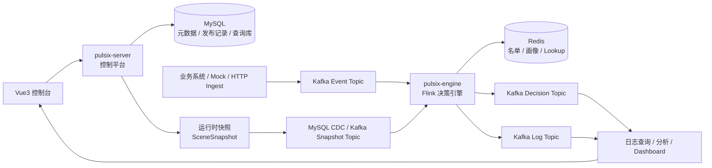

# Pulsix（脉流）

> 基于 `Spring Boot 3.5`、`Flink 1.20`、`Vue 3` 的实时风控平台。
>
> 本仓库以 `docs/方案` 下的设计文档为蓝图，围绕“控制面 + 计算面 + 分析面”构建一套可发布、可追溯、可仿真、可演进的实时风控系统。

## 项目定位

`Pulsix` 不是普通的 CRUD 后台，也不是只靠几条表达式拼起来的规则引擎。

按照 `docs/方案` 中的整体设计，它要解决的是一类更完整的实时决策问题：

- 以事件驱动，而不是以页面表单驱动
- 以状态和上下文决策，而不是只看当前一条记录
- 以“设计态 / 运行态”分离为前提，而不是直接让引擎读取多张配置表
- 以运行时快照发布为核心，而不是“改表即上线”
- 以可解释、可审计、可回放、可回滚为平台能力，而不只是单点规则执行

当前仓库仍处在从通用后台脚手架向风控平台演进的过程中：

- `system / infra / ui / server` 已具备较完整的基础能力
- `risk / kernel / engine` 已完成模块占位和依赖边界定义
- 风控主链路将按 `docs/方案` 的章节设计逐步落地

换句话说，这个仓库既包含**当前可运行的基础底座**，也包含**目标风控平台的架构方向**。

## 核心设计原则

### 1. 控制面、计算面、分析面分离

- **控制面**：定义场景、事件模型、特征、名单、规则、策略，完成校验、依赖分析、发布和仿真
- **计算面**：消费事件流和快照流，维护状态，执行实时特征与规则策略，输出决策结果
- **分析面**：承接日志、指标、命中明细、版本效果分析与运维观测

### 2. 设计态与运行态分离

后台管理的是结构化设计对象；引擎执行的是发布后生成的 `SceneSnapshot`。这意味着：

- Flink 不直接拼装几十张配置表
- 历史决策能够准确追溯到具体版本
- 配置发布、回滚、恢复都有明确边界

### 3. 仿真与线上尽量复用同一套执行内核

统一执行内核是平台可信度的基础。目标状态下：

- 控制平台仿真使用同一套规则执行核心
- Flink 线上执行也复用同一套核心能力
- 避免“仿真命中、线上不命中”的双实现偏差

### 4. 先打通主链路，再扩展能力面

仓库优先落地的主线是：

`场景配置 -> 快照发布 -> 事件进入 -> 特征计算 -> 规则执行 -> 策略收敛 -> 决策输出 -> 日志分析`

## 总体架构



从职责上看，这套系统的核心分工非常明确：

- `pulsix-server` 负责定义和发布逻辑
- `pulsix-engine` 负责执行逻辑
- 查询分析链路负责解释逻辑和观测逻辑

## 核心领域模型

`docs/方案` 将风控平台抽象为一组稳定的领域对象，整个项目都会围绕这些对象组织：

| 对象 | 说明 |
| --- | --- |
| `Scene` | 场景，风控能力的一级组织边界，如登录风控、注册反作弊、交易风控 |
| `Event` | 事件，实时决策的输入起点 |
| `Entity` | 决策关注的主体，如用户、设备、手机号、IP、银行卡 |
| `Feature` | 特征，来自流式统计、实时查询或派生计算的风险观测值 |
| `List` | 名单，黑名单、白名单、灰名单或高风险集合 |
| `Rule` | 规则，对事件和特征做判断的最小逻辑单元 |
| `Policy` | 策略，对多条规则进行收敛，产出最终动作 |
| `Decision` | 决策结果，包含动作、命中规则、命中原因、版本、耗时等信息 |
| `SceneSnapshot` | 运行时快照，设计态配置编译后的可执行版本 |

一个统一的决策抽象可以表示为：

```text
Decision = Policy(Event + StreamFeatures + LookupFeatures + Context)
```

## 技术栈

| 层次 | 技术选型 |
| --- | --- |
| 后端控制平台 | `Spring Boot 3.5.9`、`MyBatis-Plus`、`Druid`、`Redis` |
| 实时计算引擎 | `Apache Flink 1.20.3`、`Kafka`、`MySQL CDC` |
| 表达式 / 规则 | `Aviator`、`Groovy` |
| 前端控制台 | `Vue 3`、`Vite 5`、`TypeScript`、`Element Plus` |
| 元数据与查询存储 | `MySQL 8` |
| 实时查询 / 名单 / 热点特征 | `Redis` |
| 构建方式 | `Maven` 多模块、`pnpm` |

## 仓库结构

```text
pulsix/
├── docs/
│   ├── 方案/
│   └── sql/
├── pulsix-dependencies/
├── pulsix-framework/
│   ├── pulsix-common/
│   ├── pulsix-kernel/
│   └── pulsix-spring-boot-starter-*/
├── pulsix-server/
├── pulsix-module-system/
├── pulsix-module-infra/
├── pulsix-module-risk/
├── pulsix-engine/
└── pulsix-ui/
```

各模块职责如下：

| 模块 | 当前状态 | 职责 |
| --- | --- | --- |
| `pulsix-dependencies` | 已可用 | 统一 BOM 与版本管理 |
| `pulsix-framework/pulsix-common` | 已可用 | 公共工具、通用 DTO、基础枚举与错误码 |
| `pulsix-framework/pulsix-kernel` | 骨架阶段 | 统一规则执行内核，目标供仿真与 Flink 共用 |
| `pulsix-framework/pulsix-spring-boot-starter-*` | 已可用 | Web、安全、Redis、MQ、任务、监控等基础组件 |
| `pulsix-module-system` | 已可用 | 用户、角色、菜单、租户、通知等系统域能力 |
| `pulsix-module-infra` | 已可用 | 配置、文件、代码生成、任务、日志等基础设施能力 |
| `pulsix-module-risk` | 模块已创建 | 风控控制面核心业务：场景、特征、名单、规则、策略、发布、仿真、日志 |
| `pulsix-server` | 已可启动 | Spring Boot 启动器，当前主要聚合 `system` 与 `infra` |
| `pulsix-engine` | 模块已创建 | Flink 实时风控引擎，依赖和打包方式已定义 |
| `pulsix-ui` | 已可启动 | 控制台前端，当前保留通用管理后台能力 |

## 当前进度

以下状态以当前仓库代码为准，而不是以规划目标为准：

- [x] Maven 多模块工程骨架已建立
- [x] `system / infra / server / ui` 基线能力可用
- [x] `docs/方案` 已形成完整的架构、领域、快照、执行、测试与部署设计文档
- [x] `pulsix-module-risk`、`pulsix-engine`、`pulsix-kernel` 已完成模块边界占位
- [ ] 风控域数据模型与控制面 CRUD
- [ ] 运行时快照编译器与发布中心
- [ ] 控制平台仿真能力
- [ ] Flink 最小执行链路
- [ ] 决策日志、回滚、Dashboard 与监控闭环

这意味着：**当前仓库适合先验证基础底座和工程结构，风控主链路仍在按文档逐步实现。**

## 快速开始（当前仓库）

> 当前仓库以“本地开发模式”为主。
>
> `risk / engine` 主链路尚未完全落地，因此下面的步骤主要用于启动现有基础底座，而不是完整风控演示环境。

### 1. 准备环境

- `JDK 17`
- `Maven 3.9+`
- `Node.js >= 16`，推荐 `Node.js 20`
- `pnpm >= 8.6`
- `MySQL 8.x`
- `Redis 7.x`

后续当 `pulsix-engine` 落地时，再补充：

- `Kafka`
- `Flink`

### 2. 初始化数据库

当前仓库已提供基础系统与基础设施 SQL：

- `docs/sql/pulsix-system-infra.sql`

示例：

```bash
mysql -uroot -p -e "CREATE DATABASE IF NOT EXISTS pulsix DEFAULT CHARACTER SET utf8mb4 COLLATE utf8mb4_unicode_ci;"
mysql -uroot -p pulsix < docs/sql/pulsix-system-infra.sql
```

注意：

- 当前 SQL 主要覆盖 `system` 和 `infra` 基线表
- 风控域 DDL 会随着 `pulsix-module-risk` 的实现逐步补齐

### 3. 修改本地配置

后端本地配置文件：

- `pulsix-server/src/main/resources/application-local.yaml`

请先确认以下配置已改成你的本地环境：

- MySQL 地址、库名、用户名、密码
- Redis 地址、端口、密码

仓库当前默认值使用了 `test` 作为主机名，直接本地运行前需要先改成可访问的实例地址，例如 `127.0.0.1`。

### 4. 启动后端

在仓库根目录执行：

```bash
mvn -pl pulsix-server -am spring-boot:run
```

默认访问地址：

- 后端服务：`http://localhost:48080`
- OpenAPI / Swagger：`http://localhost:48080/swagger-ui`

### 5. 启动前端

进入前端目录：

```bash
cd pulsix-ui
pnpm install
pnpm dev
```

默认前端会读取：

- `pulsix-ui/.env`
- `pulsix-ui/.env.local`

注意两点：

1. `pulsix-ui/.env.local` 默认指向 `http://localhost:48080`
2. `pulsix-ui/.env` 中 `VITE_PORT=80`，在 Linux / macOS 非特权环境下通常无法直接监听 `80` 端口，建议改成 `3000` 或 `5173`

### 6. 当前可验证的内容

在风控主链路尚未接入前，你可以先验证：

- 基础登录与权限框架
- 系统管理与基础设施模块
- OpenAPI 文档、日志、任务、文件等基础能力
- 多模块工程结构与前后端联调链路

## 风控主链路落地方向

结合 `docs/方案`，仓库后续将按下面的顺序逐步补齐：

1. **设计态对象管理**：场景、事件模型、特征、名单、规则、策略
2. **快照发布**：校验、依赖分析、编译 `SceneSnapshot`、发布与回滚
3. **统一执行内核**：抽出 `pulsix-kernel`，供仿真与线上复用
4. **最小 Flink 执行链路**：事件接入、快照切换、特征计算、规则策略执行
5. **仿真与日志分析**：单条事件仿真、命中明细、版本回放、效果追踪
6. **监控与工程化**：指标、压测、部署脚本、演示环境与开源包装

## 文档导航

如果你想理解这个项目为什么这样拆，以及后续应该如何实现，建议按下面顺序阅读 `docs/方案`：

| 主题 | 推荐文档 |
| --- | --- |
| 项目认知与边界 | `第1章`、`第2章`、`第3章` |
| 总体架构与职责划分 | `第4章`、`第5章`、`第6章` |
| 控制平台数据模型与发布机制 | `第7章`、`第8章`、`第9章`、`第10章` |
| Flink 引擎与执行链路 | `第11章` 到 `第19章` |
| 控制平台与工程结构 | `第20章`、`第21章`、`第22章` |
| 测试、部署与开源包装 | `第23章`、`第24章` |
| 参考样例 | `附录A` 到 `附录E` |

其中最值得优先阅读的文档包括：

- `docs/方案/实时风控系统第1章：什么是真正的实时风控系统.md`
- `docs/方案/实时风控系统第4章：系统总体架构设计总览.md`
- `docs/方案/实时风控系统第8章：发布机制设计——为什么必须生成运行时快照.md`
- `docs/方案/实时风控系统第20章：Spring Boot 控制平台的模块设计与实现.md`
- `docs/方案/实时风控系统第22章：项目代码结构设计与从0到1的落地顺序.md`
- `docs/方案/实时风控系统第24章：部署、监控、性能优化与开源包装.md`

## 为什么 README 会同时写“现状”和“目标”

因为这个仓库目前有两个层面同时存在：

1. **现有可运行底座**：来自成熟后台工程的系统、基础设施和前端能力
2. **正在收敛的风控主线**：来自 `docs/方案` 的实时风控平台设计与实现路线

这个 README 的目标不是把规划写成既成事实，而是：

- 让你快速理解这个项目真正想做什么
- 让你知道当前代码已经做到哪一步
- 让你知道下一步应该从哪里继续推进

## 致谢

当前仓库在工程底座层面沿用了 `ruoyi-vue-pro` 风格的多模块组织方式，并在此基础上逐步收敛为专注实时风控场景的 `Pulsix` 平台。

## License

本项目使用仓库根目录中的 `LICENSE`。
