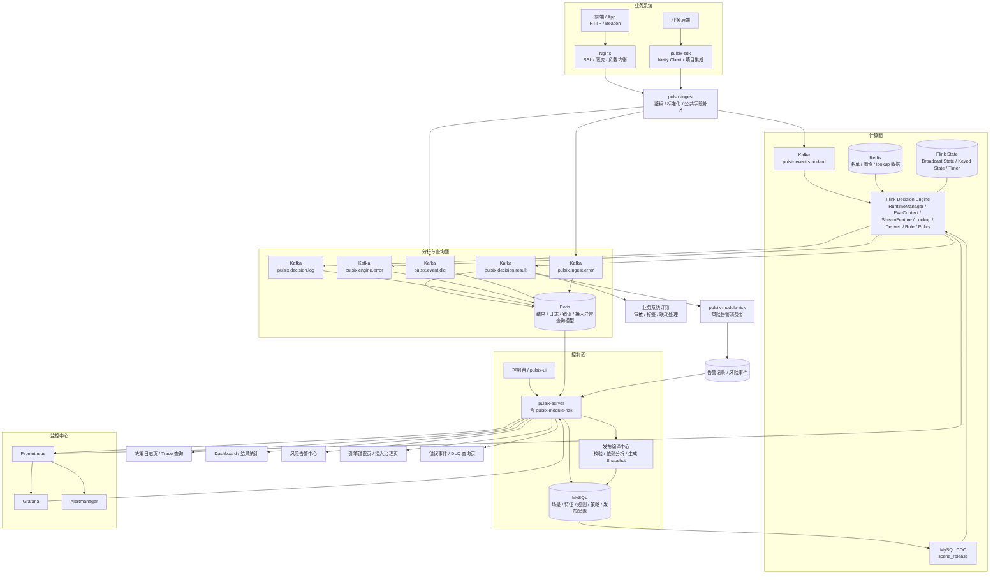

## 24.1 这一章解决什么问题

到这里，你已经把整套实时风控系统从：

- 系统认知
- 领域模型
- 架构设计
- 发布机制
- 快照设计
- Flink 运行机制
- 特征系统
- 规则与策略执行
- 控制平台实现
- 存储模型设计
- 项目代码结构
- 测试体系

基本串起来了。

但如果一个项目只停留在“代码能写、逻辑能跑”，它对求职竞争力的提升其实还是有限的。因为真正能让面试官、开源用户、甚至未来协作者认可这个项目的，不只是：

- 你是否写出了核心功能
- 你是否理解 Flink 和规则引擎

而是：

> 你是否把这个系统做成了一个**可运行、可部署、可观测、可优化、可开源传播、可被别人复现**的工程化项目。

所以这一章要解决的是最后一个非常现实的问题：

> **这个项目做完之后，如何真正把它变成一个“像样的、能拿出来讲、能让别人跑起来、能支撑求职”的完整作品？**

这一章会从五个维度来讲：

1. 如何部署
2. 如何监控
3. 如何做性能优化
4. 如何做故障排查和可观测性建设
5. 如何做开源包装与求职包装

换句话说，前 23 章主要在讲“系统怎么设计、怎么实现”，而这一章在讲：

> **系统做完之后，如何让它真正具备工程完成度。**

---

## 24.2 为什么“部署、监控、性能、开源包装”是项目成败的最后一环

很多人做项目会在一个节点停下来：

- 后台页面有了
- Flink 能跑了
- Kafka / Redis / MySQL 也连上了
- 规则能配置
- 仿真也能执行

然后就觉得项目已经完成了。

但实际上，从“能跑”到“像一个完整系统”，中间还差非常关键的一步。

因为一个真正成熟的项目，至少要满足下面这几个问题：

### 1）别人能不能一键跑起来

如果别人 clone 你的仓库之后：

- 环境太复杂
- 依赖太乱
- 没有脚本
- 没有 docker compose
- 启动顺序全靠猜

那你的项目很难传播，也很难让面试官相信你有工程化能力。

### 2）系统运行时能不能被看见

如果系统运行后你只能靠：

- 打日志
- 猜测
- 本地 debug

来判断有没有问题，那这个系统离生产思维还差很多。

### 3）系统出问题时能不能定位

风控系统是流式系统、状态系统、异步系统，如果没有监控和追踪，问题会非常难查。

### 4）你能不能向别人讲清楚“系统表现如何”

比如：

- 吞吐是多少
- 延迟是多少
- Redis 查询耗时多少
- Checkpoint 是否稳定
- 规则热更新是否成功

这些如果都没有，就很难体现项目的说服力。

### 5）别人看你的仓库时，能不能一眼看懂价值

开源项目不仅要有代码，还要有：

- README
- 架构图
- 截图
- Demo
- 快速启动方式
- 设计文档

否则哪怕代码写得不错，也很难形成传播效果。

所以你必须建立一个认知：

> **部署、监控、性能、开源包装，不是项目结束后的“装饰”，而是项目最终完成度的一部分。**

---

## 24.3 你的项目应该具备怎样的部署目标

在开始讲部署方案之前，先定义目标很重要。

对于你这个项目，我建议部署目标不要定得过重，而要定得**合理、可复现、可演示**。

建议目标如下：

### 第一层目标：本地一键运行

要求：

- 使用 Docker Compose 一键启动基础设施
- 能启动 MySQL / Redis / Kafka / Flink 相关环境
- 能启动控制平台后端
- 能启动前端
- 能运行一个本地 Demo 链路

这是最基础也最重要的一层。

### 第二层目标：单机开发环境稳定联调

要求：

- 本地开发可以分服务启动
- 能查看 Kafka topic
- 能通过 mock event 触发风控链路
- 能在页面配置规则并发布
- 能在日志页看到结果

### 第三层目标：具备小规模压测和演示能力

要求：

- 能通过压测工具连续写入事件
- 能观察 Flink 指标
- 能看 Redis / Kafka / Checkpoint 表现
- 能展示规则热更新不重启生效

### 第四层目标：可作为开源项目被别人复现

要求：

- README 清楚
- 部署步骤清楚
- 示例数据可用
- 有 Demo 视频或截图
- 有设计文档

对于个人项目，这四层已经非常足够。

你不需要一开始追求：

- K8s 生产级部署
- 多机高可用
- Helm Chart
- 多环境发布系统

这些可以作为加分项，但不是当前阶段必须。

---

## 24.4 推荐的部署形态：本地开发、Docker 演示、简化运行环境

结合你当前目标，我建议你把部署形态分成三种：

1. 本地开发模式
2. Docker Compose 演示模式
3. 轻量服务器演示模式

---

### 24.4.1 本地开发模式

适合你自己日常编码、联调、调试。

建议形态：

- 基础设施用 Docker 跑：MySQL / Redis / Kafka
- Flink 可以本地 IDE 跑 MiniCluster 或本地 standalone
- Spring Boot 后端本地启动
- 前端本地 `pnpm dev`

优点：

- 调试方便
- 修改代码快
- 断点容易下

适合阶段：

- 第 1\~4 个月高频开发期

---

### 24.4.2 Docker Compose 演示模式

这是最重要的一种模式，也是开源项目必须给出的模式。

建议至少打包和编排：

- mysql
- redis
- kafka
- zookeeper（如果你的 Kafka 版本还需要）
- flink-jobmanager
- flink-taskmanager
- pulsix-server
- pulsix-ui

可选：

- prometheus
- grafana
- kafka-ui
- redisinsight（不一定纳入 compose）

优点：

- 别人最容易复现
- 适合录 Demo
- 适合写 README
- 适合做面试展示

适合阶段：

- 第 5\~6 个月收尾与开源阶段

---

### 24.4.3 轻量服务器演示模式

如果你后面想把项目部署到云服务器给面试官展示，可以用一台 2C4G/4C8G 的轻量服务器。

建议：

- 使用 Docker Compose 部署
- 暴露前端与后端端口
- 演示环境可选：
  - UI 页面
  - Kafka UI
  - Grafana

这会让你的项目从“本地作品”升级为“在线可演示作品”。

不过这不是当前必须项，可以作为后期增强。

---

## 24.5 Docker Compose 应该如何组织

你的 `deploy/` 目录建议至少有下面这些文件：

```latex
deploy/
├── docker-compose.yml
├── docker-compose.observability.yml
├── env/
│   ├── mysql.env
│   ├── kafka.env
│   ├── redis.env
│   └── admin.env
├── init/
│   ├── mysql-init.sql
│   ├── kafka-topics.sh
│   └── seed-data.sql
├── scripts/
│   ├── start.sh
│   ├── stop.sh
│   ├── restart.sh
│   ├── load-demo-data.sh
│   └── submit-flink-job.sh
└── README.md
```

这种目录结构的好处是：

- 基础设施与脚本分开
- 初始化数据明确
- 便于开源项目说明
- 便于你后续扩展 Prometheus / Grafana

---

## 24.6 推荐的启动顺序

实时系统通常对启动顺序比较敏感。建议在 README 和脚本中明确启动顺序。

### 推荐顺序

#### 第 1 步：启动基础设施

- MySQL
- Redis
- Kafka

#### 第 2 步：初始化数据库与 topic

- 执行初始化 SQL
- 创建 Kafka topics
- 导入演示用场景、规则、名单等示例数据

#### 第 3 步：启动 Flink 集群

- JobManager
- TaskManager

#### 第 4 步：启动控制平台后端

- `pulsix-server`

#### 第 5 步：启动前端

- `pulsix-ui`

#### 第 6 步：提交 Flink Job

- 决策引擎 job

#### 第 7 步：导入 Demo 数据 / 发压测事件

- 通过脚本往 Kafka 写入样例事件

这样做的目的，是让别人不会在启动时踩下面这些坑：

- Kafka 还没 ready，Flink 就起了
- 数据库没初始化，后端就报错
- Flink Job 启动时找不到 topic
- 后端页面起来了，但演示数据为空

---

## 24.7 需要提供哪些“开箱即用”的初始化内容

这是很多开源项目容易忽略的一点。

如果你想让别人一跑就有东西可看，就必须提供一套最小初始化内容。

建议至少提供：

### 1）默认账号

例如：

- admin / admin123

### 2）默认场景

- LOGIN\_RISK
- REGISTER\_ANTI\_FRAUD
- TRADE\_RISK

### 3）默认特征

例如：

- user\_trade\_cnt\_5m
- user\_trade\_amt\_sum\_30m
- device\_bind\_user\_cnt\_1h
- device\_in\_blacklist
- high\_amt\_flag

### 4）默认规则

例如：

- 黑名单设备直接拒绝
- 高频大额交易进入审核
- 高风险等级 + 多账号设备直接拒绝

### 5）默认策略

- TRADE\_RISK\_POLICY
- LOGIN\_RISK\_POLICY
- REGISTER\_POLICY

### 6）默认名单样例

- 几个设备黑名单
- 几个高风险 IP

### 7）默认仿真样例

- 一条会 PASS 的事件
- 一条会 REVIEW 的事件
- 一条会 REJECT 的事件

这会大幅提升用户首次体验。

---

## 24.8 监控体系应该如何建设

接下来讲监控。这个部分对实时系统特别重要。

我建议你把监控分成三类：

1. 系统层监控
2. 中间件层监控
3. 业务层监控

---

### 24.8.1 系统层监控

主要关注服务本身是否健康。

例如：

#### Spring Boot 后端

- JVM 内存
- GC 次数和停顿
- HTTP QPS
- 接口 RT
- 错误率
- 数据库连接池使用情况

#### Flink 引擎

- 作业状态
- subtask 并行度
- 各算子吞吐
- backpressure
- checkpoint 成功率
- checkpoint 时长
- restart 次数

这些指标是基础监控。

---

### 24.8.2 中间件层监控

主要关注 Kafka / Redis / MySQL 等基础设施。

#### Kafka

建议关注：

- topic 吞吐
- consumer lag
- 分区情况
- broker 健康状态

#### Redis

建议关注：

- 内存使用
- hit rate
- ops/sec
- 慢查询
- 网络延迟

#### MySQL

建议关注：

- active connections
- 慢 SQL
- 事务等待
- 锁冲突
- CPU / IO 使用

这些监控可以先简单做，不一定都要接最完整 exporter，但至少要有基本观测。

---

### 24.8.3 业务层监控

这是你这个项目最能体现平台思维的部分。

建议至少暴露下面这些业务指标：

#### 事件输入量

- 每个场景每分钟事件数
- 每种 eventType 处理数

#### 事件接入质量

- 事件解析成功率
- 标准化失败率
- 字段补齐次数
- `DLQ` 事件数量与趋势
- 接入源启停状态
- SDK 长连接数与重连次数

#### 决策结果分布

- PASS 数量
- REVIEW 数量
- REJECT 数量

#### 规则命中情况

- 每条规则命中次数
- 每条规则命中率

#### 决策耗时

- 平均耗时
- P95
- P99

#### Redis lookup 指标

- lookup 次数
- 成功率
- 平均耗时

#### 配置版本指标

- 当前活跃版本
- 最近切换时间
- 切换失败次数

这些指标一旦接起来，你的项目就明显更像一个可运营平台。

---

## 24.9 推荐的可观测性技术选型

你不需要一开始把 observability 做到特别重，但建议至少搭一套基础组合。

### 推荐方案

- **Micrometer**：Spring Boot 指标暴露
- **Prometheus**：指标采集
- **Grafana**：指标可视化
- **Flink Web UI**：查看作业状态
- **Kafka UI**：查看 topic/lag

如果你愿意进一步增强，可以考虑：

- Loki：日志聚合
- Tempo / Jaeger：链路追踪

但对于当前项目，Prometheus + Grafana + Flink UI + Kafka UI 已经足够好。

---

## 24.10 Dashboard 应该重点展示什么

Dashboard 不要做成一堆花里胡哨的图，而要围绕“风控平台最关键的问题”来设计。

建议首页重点展示：

### 第一类：业务总览

- 今日事件总量
- 今日决策总量
- 通过率 / 审核率 / 拒绝率
- 场景分布

### 第二类：规则效果

- 命中 Top 10 规则
- 规则命中趋势
- 高风险事件趋势

### 第三类：系统状态

- 当前活跃版本
- Flink Job 状态
- Kafka Lag
- Checkpoint 成功率
- 决策 P95 耗时

### 第四类：异常提示

- 最近发布失败
- 最近规则编译失败
- 最近 lookup 超时告警
- 最近引擎异常数

一个好的 Dashboard 不是信息越多越好，而是：

> **让你 10 秒钟内知道系统当前是否健康、业务结果是否异常。**

---

## 24.11 性能优化应该重点看哪些地方

实时风控系统的性能优化，一定要讲“重点路径”。

你项目里最值得关注的性能热点主要有五类：

1. Kafka 输入与反序列化
2. Flink 状态与算子执行
3. Redis lookup
4. 表达式 / Groovy 执行
5. 日志输出链路

---

### 24.11.1 Kafka 输入与反序列化

常见问题：

- 事件 JSON 太大
- 反序列化开销高
- topic 分区不合理
- consumer 并行度不匹配

优化建议：

- 控制事件大小
- 尽量简化事件结构
- 统一反序列化模型
- 分区数与 job 并行度协调
- 关键字段尽量扁平化

---

### 24.11.2 Flink 状态与算子执行

这是最核心的优化点之一。

常见瓶颈：

- state 太大
- bucket 设计不合理
- TTL 不清理
- distinct 结构过重
- 算子链路过长
- 单个 key 热点严重

优化建议：

- 只保留必要状态
- 尽量 bucket 化管理窗口态
- 合理设置 TTL
- 避免一开始就上复杂精确去重结构
- 对热点 key 做监控
- 合理选择 HashMapStateBackend / RocksDBStateBackend

---

### 24.11.3 Redis lookup

实时决策很容易被外部 lookup 拖慢。

常见问题：

- 每条事件查太多 key
- 单次 Redis round-trip 太多
- key 设计不合理
- 热点 key 导致抖动
- lookup 超时控制不好

优化建议：

- 尽量减少 lookup 次数
- 能批量查的尽量批量查
- 常用数据做本地 cache
- 设置合理超时与默认值
- key 设计保持稳定、短小、清晰
- 将高频名单查做轻量结构，如 String/Set，而不是复杂嵌套 JSON

---

### 24.11.4 表达式 / Groovy 执行

常见问题：

- 每条事件动态编译
- 上下文构造过重
- Groovy 脚本写得太复杂
- 反射太多
- binding 对象频繁创建

优化建议：

- 发布时预编译
- 执行时只做上下文绑定
- 表达式优先，Groovy 作为扩展
- 尽量让高频逻辑落在表达式引擎，而不是 Groovy
- 规则上下文结构扁平且稳定

---

### 24.11.5 日志输出链路

常见问题：

- 热路径同步写 MySQL
- 日志对象过大
- 决策后还做复杂同步统计

优化建议：

- 决策结果异步写 Kafka
- 再由下游异步落库
- 控制日志字段体积
- 只记录必要快照，不要过度记录无用大字段

---

## 24.12 你应该如何定义项目的性能目标

性能目标一定要真实，不能瞎写一个“10 万 TPS”。

结合个人项目、Docker 环境、Flink 单作业、Redis/MySQL/Kafka 本地部署，我建议这样定义：

### 本地 Docker 演示环境目标

- 吞吐：1000 \~ 3000 EPS
- 决策延迟：P95 < 300ms
- 配置热更新时间：< 10s

### 单机稍强化环境目标

- 吞吐：3000 \~ 10000 EPS
- 决策延迟：P95 < 200ms

### 你在 README 中的表达方式建议

不要写死“本系统支持 XX 万 TPS”，建议写成：

> 在本地 Docker Compose 演示环境下，使用模拟交易事件压测，系统可稳定处理 1000\~3000 EPS，P95 决策延迟维持在 300ms 以内；具体性能与机器配置、规则复杂度、外部 lookup 数量有关。

这种写法更真实，也更专业。

---

## 24.13 常见性能与运行问题应该怎么排查

这部分非常重要，因为面试时很容易被问：

- 如果延迟高了你怎么查？
- 如果规则没生效你怎么查？
- 如果 Kafka 堆积了你怎么查？

你应该至少建立下面这些排查思路。

---

### 24.13.1 决策延迟突然升高

优先排查路径：

1. 看 Kafka lag 是否升高
2. 看 Flink 算子 backpressure
3. 看 Redis RT 是否上升
4. 看最近是否发布了复杂规则/Groovy
5. 看日志链路是否阻塞
6. 看 checkpoint 是否频繁失败

---

### 24.13.2 规则没有生效

优先排查：

1. 控制平台是否真的生成新版本
2. MySQL CDC / 配置下发链路是否正常
3. Flink 是否收到新 snapshot
4. Broadcast State 当前版本是什么
5. 本地 compiled runtime 是否更新
6. 事件日志里记录的 version 是什么

这就是为什么版本号和日志追踪非常重要。

---

### 24.13.3 决策结果异常偏高或偏低

优先排查：

1. 最近有没有发布新版本
2. 哪条规则命中率突然变化
3. lookup 特征默认值是否错误
4. Redis 名单数据是否异常
5. stream feature 计算是否 warm-up 不充分

---

### 24.13.4 Flink Job 不稳定

优先排查：

1. checkpoint 失败日志
2. RocksDB/状态大小
3. taskmanager 内存
4. 配置广播是否异常
5. 某些 Groovy 执行是否抛错过多
6. 下游 sink 是否阻塞

---

### 24.13.5 Kafka 积压严重

优先排查：

1. 分区数是否足够
2. Flink 并行度是否过低
3. 某个算子是否 backpressure
4. Redis lookup 是否成为瓶颈
5. 决策链路是否加入太多同步逻辑

---

## 24.14 应该如何做日志与问题定位设计

一个成熟系统的日志，不是“哪里报错打哪里”，而要围绕链路做统一设计。

建议至少建立下面三类日志：

### 1）业务决策日志

用于查：

- 某条事件怎么判的
- 命中了什么规则
- 特征值是多少
- 最终结果是什么

### 2）发布与配置日志

用于查：

- 哪个版本何时发布
- 哪个版本编译失败
- 哪次回滚到哪个版本
- 快照 checksum 是什么

### 3）运行错误日志

用于查：

- lookup 超时
- 表达式执行错误
- Groovy 运行异常
- 配置切换失败
- sink 异常

日志设计建议：

- 带 `traceId`
- 带 `sceneCode`
- 带 `version`
- 带 `eventId`
- 带 `ruleCode`（命中类日志）

这会极大提升排障效率。

---

## 24.15 开源项目应该怎么包装

到了这一节，重点已经不是“系统能不能跑”，而是：

> **别人看到你的仓库，能不能迅速理解它的价值，并愿意 star 或继续看下去。**

我建议你把开源包装分成 6 个部分来做。

---

### 24.15.1 README 必须写清楚的内容

建议 README 至少包含：

#### 1）项目是什么

一句话描述：

> `pulsix` 是一个基于 Spring Boot 3、Flink 1.20、Kafka、Redis 构建的脉流实时风控平台。

#### 2）项目解决什么问题

- 规则配置化
- Flink 实时特征计算
- 配置快照热更新
- 决策日志可追溯
- 仿真测试和回滚能力

#### 3）核心架构图

至少一张总架构图。

#### 4）核心能力清单

例如：

- 场景中心
- 特征中心
- 规则中心
- 策略中心
- 发布与热更新
- 仿真测试
- 决策日志

#### 5）快速启动步骤

- 环境要求
- docker compose 启动命令
- 默认账号
- demo 数据导入方式

#### 6）Demo 展示

- 页面截图
- 规则发布截图
- 仿真页截图
- 日志页截图

#### 7）路线图

- 已完成
- 计划中

一个好的 README，已经能决定项目给人的第一印象。

---

### 24.15.2 架构图一定要有

建议至少准备三张图：

1. 总体架构图
2. 发布与快照流转图
3. 一条事件的处理时序图

这三张图比你写很多字更有说服力。

#### 24.15.2.1 推荐直接放到 README 的总体架构图

下面这版图，比较适合你当前项目的一期方案，也比较适合演示“控制面 + 计算面 + 分析面 + 监控面 + 业务订阅”的完整闭环。



#### 24.15.2.2 这张图里最关键的 7 个表达点

1. **配置走 MySQL + 发布快照 + CDC，不让 Flink 直接查后台多张设计表。**
2. **事件走 `pulsix.event.standard`，把接入层和 Flink 执行层解耦。**
3. **Flink 运行时依赖 `Flink State + Redis lookup` 构建完整上下文，再执行规则和策略。**
4. **`pulsix.decision.result`、`pulsix.decision.log`、`pulsix.engine.error` 三条输出流先进入 Kafka。**
5. **三条输出流统一进入 Doris，形成 `pulsix-server` 的查询读模型。页面不要直接查 Kafka。**
6. **`pulsix.decision.result` 除了进入 Doris，还应保留一条给业务系统订阅的链路；同时可由 `pulsix-module-risk` 订阅并生成风险告警。**
7. **`pulsix.event.dlq` 与 `pulsix.ingest.error` 也应下沉 Doris，由 `pulsix-module-risk` 的接入治理页、错误事件页统一查询展示。**

#### 24.15.2.3 三条输出流在图中的职责分工

##### `pulsix.decision.result`

- 定位：轻量最终决策结果流。
- 主要内容：`traceId`、`eventId`、`sceneCode`、`finalAction`、`finalScore`、`version`、`hitRuleCodes`、`decisionTime`。
- 谁使用：
  - 业务系统订阅
  - `pulsix-module-risk` 风险告警消费者
  - Dashboard 结果统计
- 为什么要保留 Kafka：
  - 它本质上是业务结果事件流
  - 适合被多个下游实时订阅
  - 适合保留回放与补偿能力

##### `pulsix.decision.log`

- 定位：详细决策追溯流。
- 主要内容：输入事件摘要、`featureSnapshot`、`hitRulesDetail`、`reason`、`latencyMs`、`errorInfo`、版本信息。
- 谁使用：
  - 决策日志查询页
  - traceId / eventId 明细页
  - 版本回溯与问题排查
- 为什么先进 Kafka 再进 Doris：
  - Kafka 负责解耦热路径和日志下沉
  - Doris 负责多条件查询、分页和分析
  - 页面应查 Doris，不应直接消费 Kafka

##### `pulsix.engine.error`

- 定位：引擎运行错误与异常流。
- 主要内容：配置解析失败、表达式 / Groovy 异常、Redis lookup 异常、运行时错误。
- 谁使用：
  - 引擎错误页
  - 接入治理页
  - 异常趋势分析
  - Alertmanager / 告警治理
- 为什么既要进 Kafka 也要进 Doris：
  - Kafka 便于异步告警和故障隔离
  - Doris 便于历史排查和错误趋势分析

#### 24.15.2.4 `pulsix-module-risk` 与这三条流怎么交互

`pulsix-module-risk` 不建议为了页面查询去直接消费 Kafka。更合理的职责划分是：

- **页面查询**：`pulsix-server` / `pulsix-module-risk` 查 Doris。
- **配置管理**：查写 MySQL。
- **监控展示**：查 Prometheus / Grafana。
- **风险告警生成**：由 `pulsix-module-risk` 内部的告警消费者订阅 `pulsix.decision.result`，生成告警记录，再供页面查询。

也就是说：

- Kafka 是**流转总线**
- Doris 是**查询读库**
- `pulsix-module-risk` 是**控制面业务模块**

#### 24.15.2.5 这一版图为什么适合 Demo 展示

因为它能把完整闭环清楚地展示出来：

1. 控制台配置场景 / 特征 / 规则 / 策略
2. 发布编译成快照并通过 CDC 更新到 Flink
3. 业务事件经接入层进入 Kafka
4. Flink 实时计算特征、lookup、执行规则与策略
5. 决策结果 / 决策日志 / 引擎异常分别输出
6. 结果流一条给业务订阅，一条进入控制面生成风险告警
7. Doris 承担日志、结果、异常的统一查询模型
8. `pulsix-server` 向前端提供 Dashboard、日志查询、告警中心、错误治理等页面能力

这会比只画“Flink -> Kafka -> 日志库”更能体现你的平台化能力。

---

### 24.15.3 页面截图一定要有

建议至少展示：

- Dashboard
- 规则中心
- 特征中心
- 发布中心
- 仿真测试页
- 决策日志页

别人看到图，会更容易理解这是个平台而不是一个后端 demo。

---

### 24.15.4 Demo 视频非常加分

建议录一个 3\~8 分钟的小视频，演示：

1. 登录后台
2. 查看场景与规则
3. 修改一条规则
4. 点击发布
5. 发送一条测试事件
6. 查看日志结果
7. 展示监控或 Dashboard

这个视频对求职非常有用，因为你可以：

- 放在仓库 README
- 面试前发给面试官
- 面试中现场辅助展示

---

### 24.15.5 技术博客有巨大加分作用

你这个项目非常适合配套写几篇博客，题目可以是：

- 从 0 到 1 设计脉流实时风控平台（pulsix）
- Flink + Broadcast State 实现规则热更新
- 实时风控系统中的运行时快照设计
- 表达式引擎和 Groovy 在实时决策中的边界
- 风控系统中 stream feature 的状态设计

博客的作用：

- 帮你沉淀思路
- 帮你反向优化项目结构
- 帮你在简历之外建立技术影响力

---

### 24.15.6 GitHub 仓库结构和提交信息要整洁

建议：

- 模块命名清楚
- docs 目录清楚
- commit message 清晰
- release tag 明确

例如：

- `v0.1.0-mvp`
- `v0.5.0-hot-update`
- `v1.0.0-first-release`

这会让项目成熟度更高。

---

## 24.16 这个项目在简历上应该怎么包装

这是最后一个非常现实的问题。

你的目标不是“把项目堆上简历”，而是：

> **让项目成为你现有经历的增强器。**

你的经历本来就有实时风控、Flink、动态规则、发布体系这些背景，所以这个项目最适合包装成：

> 结合真实生产经验沉淀出来的一套开源脉流实时风控平台。

### 简历描述建议强调的关键词

- 实时风控
- Flink 1.20
- Spring Boot 3
- Kafka / Redis
- 规则配置化
- 运行时快照
- Broadcast State 热更新
- 流式特征计算
- 决策日志追溯
- 仿真测试 / 版本回滚

### 简历描述示例思路

可以描述成：

> 独立设计并实现 `pulsix` 脉流实时风控平台，面向账户安全与交易风控场景，基于 Spring Boot 3、Flink 1.20、Kafka、Redis 构建，支持流式特征计算、规则配置化、运行时快照发布、Broadcast State 热更新、决策日志追溯与仿真测试；项目提供 Docker Compose 一键部署与完整 Demo 链路，具备较强的工程化与平台化特征。

这种表述既体现了你做了系统，又体现了你理解平台。

---

## 24.17 面试时应该如何讲这套系统

你后面在面试里讲这个项目时，建议不要按“页面”讲，而按“问题 -> 设计 -> 核心难点 -> 落地效果”来讲。

建议讲法：

### 1）先讲问题背景

- 传统规则硬编码、上线慢、修改成本高
- 风控需要实时特征和不停机热更新

### 2）再讲系统架构

- 控制面 / 计算面 / 分析面分层
- Spring Boot 管理设计态
- Flink 执行运行态
- Redis 做名单画像 lookup

### 3）再讲最核心设计点

- 发布时生成运行时快照
- Flink 用 Broadcast State 持有快照
- 表达式优先，Groovy 作为扩展
- stream feature 模板化而不是任意脚本化

### 4）最后讲工程完成度

- Docker Compose
- Prometheus / Grafana
- 决策日志
- 仿真测试
- 回滚与版本管理

这样讲会比“我做了规则页、特征页、日志页”更有说服力。

---

## 24.18 最终交付物清单建议

如果你希望这个项目在 6 个月后真正“像一个作品”，建议最终至少交付下面这些内容：

### 代码层

- `pulsix-server`
- `pulsix-engine`
- `pulsix-ui`
- `pulsix-framework/pulsix-common`
- `pulsix-framework/pulsix-kernel`
- `pulsix-module-system`
- `pulsix-module-infra`
- `pulsix-module-risk`
- `deploy/`
- `docs/`

### 文档层

- README
- 架构图
- 快速启动文档
- 压测说明
- 设计文档

### 演示层

- 页面截图
- Demo 视频
- 示例数据
- 仿真用例

### 工程层

- Docker Compose
- 基础监控
- 默认初始化脚本
- 一套稳定演示链路

这套交付物一旦完整，你的项目就会非常有竞争力。

---

## 24.19 本章小结

这一章本质上是在回答：

> **一个实时风控平台做完功能后，如何真正把它做成一个完整、可运行、可展示、可传播的工程项目。**

我们把核心结论收一下：

### 1）部署目标要现实

- 本地可开发
- Docker 可演示
- 轻量服务器可展示

### 2）必须提供一键运行能力

- docker compose
- 初始化脚本
- 默认账号与样例数据

### 3）监控体系要覆盖三层

- 系统层
- 中间件层
- 业务层

### 4）性能优化要抓热路径

- Kafka 输入
- Flink 状态
- Redis lookup
- 表达式/Groovy 执行
- 日志输出链路

### 5）日志和可观测性决定你是否真的能排障

- traceId
- version
- sceneCode
- ruleCode
- eventId

### 6）开源包装和求职包装同样重要

- README
- 架构图
- 截图
- Demo 视频
- 博客
- 简历描述

一句话总结这一章：

> **系统做完不算完成，能被别人稳定跑起来、看懂、验证、观察、复现，才算真正完成。**

---

## 24.20 全书收束：你接下来最应该做什么

如果把前 24 章收束成一句行动建议，那就是：

> **不要再继续空想一个“大而全的平台”，而是立刻开始做一个“可运行、可发布、可热更新、可追溯、可展示”的最小完整实时风控平台。**

你接下来的最佳动作顺序建议是：

1. 先搭仓库结构和 deploy 基础骨架
2. 把控制平台最小模型和发布快照先打通
3. 把 Flink 引擎的事件流 + 配置流 + 最小规则执行链路跑通
4. 再补特征、日志、仿真、Dashboard
5. 最后打磨监控、README、视频、博客

做到这一步，你这个项目就不再只是“练手”，而会真正成为你求职竞争力里非常强的一张牌。
