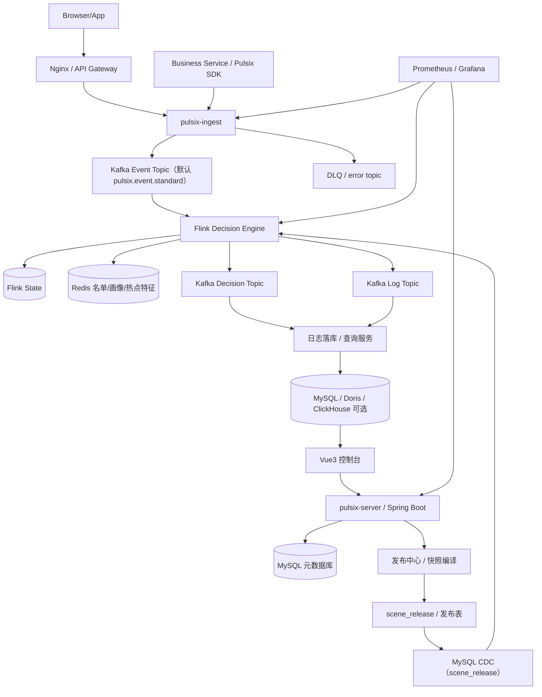

## 第 4 章：系统总体架构设计总览

### 4.1 这一章解决什么问题

前面三章，我们已经完成了三件事：

- 明确了你要做的是**脉流实时风控平台**，不是普通规则引擎
- 明确了系统的核心领域对象： **Scene / Event / Entity / Feature / List / Rule / Policy / Decision / Snapshot**
- 明确了系统边界：哪些能力必须做，哪些能力可以后置，哪些能力不应该前期硬上

接下来就要回答一个更工程化的问题：

> 这套系统从整体架构上，到底应该长成什么样？

这个问题看起来像“画个架构图”那么简单，但实际上它会直接决定后面所有核心设计：

- 控制平台怎么做
- Flink 引擎怎么接配置
- Kafka 里要有哪些 Topic
- Redis 里放什么数据
- MySQL 里存什么
- 决策日志怎么走
- 为什么要发布快照而不是让 Flink 直接连表
- 为什么一个人做项目时不适合一开始就拆很多微服务

所以这一章的目标，不是给你一张漂亮图，而是要建立一套**真正能支撑后续实现的总体架构认知**。

这一章会重点回答：

1. 为什么实时风控系统天然适合做成分层架构
2. 控制平台、Flink 引擎、消息层、存储层、分析层分别负责什么
3. Spring Boot、Flink、Kafka、Redis、MySQL 在系统中的角色是什么
4. 为什么不建议你一开始就拆很多微服务
5. 一个个人开源项目最合理的工程形态应该是什么样

---

### 4.2 实时风控系统为什么一定是“分层架构”

很多系统即使不强调分层，也可以先跑起来。 但实时风控系统如果不分层，后面几乎一定会变乱。

因为这个系统天然存在几类完全不同的问题：

#### 第一类：设计态问题

比如：

- 规则怎么配置
- 特征怎么定义
- 场景怎么组织
- 发布版本怎么管理
- 谁改了什么怎么审计

这是典型的“后台管理问题”。

---

#### 第二类：运行态问题

比如：

- 每秒几千几万条事件怎么处理
- 状态怎么维护
- 配置怎么热更新
- 决策怎么低延迟输出
- 引擎怎么容错恢复

这是典型的“实时计算问题”。

---

#### 第三类：分析态问题

比如：

- 某条规则命中率多少
- 某次决策为什么被拒绝
- 哪个版本上线后拒绝率变高了
- 当前系统延迟是否异常

这是典型的“查询、分析、监控问题”。

---

如果你把这三类问题混在一起做，就会出现典型混乱：

- 控制平台一边写表，一边试图直接参与热路径执行
- Flink 一边做流计算，一边查一堆后台设计表
- 日志一边走热链路，一边同步写数据库导致延迟上升
- Redis 一会儿当元数据仓库，一会儿当热状态仓库，一会儿又当报表库

所以成熟平台一定会分层。 从架构认知上，你应该把实时风控系统理解为：

> **控制面 + 计算面 + 分析面 + 消息层 + 存储支撑层**

也就是说，它不是一个单体“后台系统”，而是一个**以实时计算为核心的分层平台**。

---

### 4.3 这套系统的总体架构目标是什么

在画架构之前，先要知道你想达到什么目标。 否则架构图只是堆组件。

我建议你这个项目的总体架构目标，至少包含下面五个：

#### 1）低延迟

事件进入后，系统能在毫秒到秒级内完成决策。

#### 2）动态化

规则、策略、名单、部分特征定义可以热更新，而不是每次改代码重启任务。

#### 3）可解释

决策结果必须能回溯：

- 用的哪个版本
- 命中了哪些规则
- 命中时的特征值是多少

#### 4）可演进

一期做基础规则，后面可以逐步扩展：

- 评分卡
- CEP
- Groovy 高级规则
- 回放测试

#### 5）可运维

要能监控：

- Kafka Lag
- Flink Checkpoint
- Backpressure
- 决策延迟
- 规则命中率

这五个目标，决定了系统不能只是一套 CRUD 后台，也不能只是一个 Flink Demo。

---

### 4.4 我推荐的总体架构形态

我先给你一版推荐的总体架构图，然后我们再逐层展开。



如果不用图形化工具，也可以先按下面这种结构理解：

```latex
                ┌──────────────────────────────┐
                │          前端控制台           │
                │ 场景/特征/规则/策略/发布/日志 │
                └──────────────┬───────────────┘
                               │ HTTP
                      ┌────────▼────────┐
                      │   pulsix-server     │
                      │ Spring Boot 3.5 │
                      └──────┬─────┬────┘
                             │     │
                       MySQL │     │ 快照发布
                             │     │
                  ┌──────────▼─┐   │
                  │ 元数据配置库 │   │
                  └──────┬─────┘   │
                         │ CDC      │
                         ▼          │
                Flink CDC Config Source│
                                    │
Browser/App / 业务系统 / Pulsix SDK   │
      │                              │
      ▼                              │
Nginx / pulsix-ingest -> Kafka Event Topic（pulsix.event.standard） │
      │                              │
      ▼                              ▼
┌─────────────────────────────────────────────────────┐
│                Flink Decision Engine                │
│ 1. 事件标准化                                       │
│ 2. 实时特征计算（State / Timer / Window）          │
│ 3. 读取 Broadcast State 运行时快照                 │
│ 4. 查询 Redis 名单/画像                            │
│ 5. 执行派生特征、规则、策略                         │
│ 6. 输出决策结果与决策日志                           │
└──────────────┬──────────────────────────┬──────────┘
               │                          │
               ▼                          ▼
        Redis Feature/Lookup        Kafka Decision/Log Topics
               │                          │
               └──────────────┬───────────┘
                              ▼
                      MySQL / Doris / 查询层
```

这个架构其实已经表达了一个核心思想：

> **控制平台负责“生成可执行逻辑”，Flink 负责“执行可执行逻辑”，分析层负责“查看执行结果”。**

---

### 4.5 为什么要拆成控制平台、Flink 引擎、消息层、存储层

这一节我们不只是说“这样拆比较清晰”，而是要说清楚为什么必须这么拆。

---

#### 4.5.1 控制平台：负责“定义和发布逻辑”

控制平台的本质职责不是执行决策，而是：

- 管理场景
- 管理事件模型
- 管理特征定义
- 管理名单
- 管理规则
- 管理策略
- 做表达式校验
- 做依赖分析
- 生成运行时快照
- 发布版本和回滚
- 做仿真测试
- 做审计和管理查询

也就是说，控制平台负责的是**设计态**。

它关心的问题是：

- 配置是否正确
- 依赖是否完整
- 版本是否可发布
- 运行时要执行什么计划

它不应该承担：

- 热路径实时计算
- 大规模事件处理
- 高频状态演化

所以控制平台通常用 Spring Boot + MySQL 非常合适。

---

#### 4.5.2 Flink 引擎：负责“实时执行逻辑”

Flink 引擎的职责是：

- 消费业务事件
- 消费发布快照
- 维护状态
- 计算流式特征
- 查询 Redis 名单/画像
- 执行规则
- 做策略收敛
- 输出决策与日志

它关心的问题是：

- 延迟
- 吞吐
- 状态一致性
- Checkpoint 恢复
- 配置热切换

它不应该承担：

- 后台管理表增删改查
- 多表拼装配置
- 复杂发布流程
- 管理型查询和审计页面

Flink 在这里的角色，不是“顺便做点窗口统计”，而是整个系统的**运行时决策引擎**。

---

#### 4.5.3 消息层：负责“解耦和流转”

Kafka 这样的消息层在这套系统里非常关键，因为它把事件输入、结果输出以及日志/异常处理解耦了。

它主要承接：

- 原始事件流
- 决策结果流
- 决策日志流
- 死信流 / 异常流

如果没有消息层，你会发现系统耦合会很重：

- 业务系统直接调 Flink 不现实
- 控制平台直接推配置到每个 Task 不稳定
- 决策结果同步写多份存储会拖慢热路径

所以消息层在这里不是附属，而是平台级总线。

---

#### 4.5.4 存储层：负责“不同类型数据的最优承载”

这套系统里没有哪一种存储能解决所有问题，所以必须分工。

- **MySQL**：元数据、版本、审计、管理查询
- **Redis**：名单、画像、热点 lookup、部分 materialized 特征
- **Flink State**：短周期中间计算状态、窗口状态、定时器状态
- **Doris / ClickHouse（可选）** ：大规模决策日志分析

如果你试图只用一种存储做所有事情，系统大概率会失衡。

---

### 4.6 系统的五层架构视图

为了帮助你形成整体理解，我建议你以后都用“五层视角”看这套系统。

---

#### 第一层：接入层

负责接收事件。

来源可能有：

- 前端 / App 埋点（`HTTP / Beacon`）
- 业务后端通过 `Pulsix SDK(Netty)` 上送
- API 推送 / 模拟器 / 可选 CDC 事件源

接入层的职责是：

- 接收数据
- 鉴权与来源识别
- 基本校验
- 字段标准化与公共字段补齐
- 写入 Kafka `standard topic`
- 异常数据写入 `DLQ / error topic`

结合当前方案，一期建议把接入层独立为：

- `pulsix-access/pulsix-ingest`
- `pulsix-access/pulsix-sdk`

---

#### 第二层：控制层

也就是控制平台。

负责：

- 管理配置
- 编译发布
- 仿真测试
- 审计和权限

这是“人和系统交互”的主要入口。

---

#### 第三层：计算层

也就是 Flink 决策引擎。

负责：

- 消费事件与配置
- 计算特征
- 执行规则
- 输出决策

这是整套平台的核心执行层。

---

#### 第四层：数据支撑层

包括：

- Kafka
- Redis
- MySQL
- Flink State
- 可选的日志分析库

这是平台运行的基础设施层。

---

#### 第五层：分析与观测层

负责：

- 决策日志查询
- 命中分析
- 监控大盘
- 审计追踪
- 运行告警

很多人做项目时容易忽视这一层，但这层决定了系统是不是“可运营、可解释”。

---

### 4.7 Spring Boot、Flink、Kafka、Redis、MySQL 在系统中的角色

这一节非常重要，因为很多项目失败不是技术不会，而是组件职责没分清。

---

#### 4.7.1 Spring Boot：控制面的核心承载者

在你的项目里，Spring Boot 主要负责：

- 后台管理接口
- RBAC 权限
- 场景管理
- 事件模型管理
- 特征/规则/策略管理
- 快照编译
- 发布与回滚
- 仿真测试
- 管理型查询

为什么它适合做控制平台？

因为这些需求的本质是：

- CRUD + 业务编排
- 事务处理
- 管理权限
- 表达式校验
- 版本控制

这些都是 Spring Boot + MySQL 很擅长的。

但 Spring Boot 不适合承担：

- 高吞吐流式状态计算
- 高并发长时间事件处理
- 流式 checkpoint 容错

所以你要非常明确：

> **Spring Boot 是控制面的“大脑”，不是运行时引擎。**

---

#### 4.7.2 Flink：计算面的核心引擎

Flink 在这个系统里的定位，不是一个“窗口工具”，而是：

> **运行时状态计算与在线决策执行引擎**

它擅长的事情包括：

- 高吞吐处理事件流
- 维护 Keyed State
- 使用 Timer 做过期清理
- 接收广播配置
- 做低延迟上下文拼装
- 执行规则与策略
- 恢复状态
- 保证容错

你后面所有最关心的：

- 快照怎么进 Flink
- 特征怎么计算
- 中间数据怎么存
- 表达式/Groovy 怎么执行

都属于 Flink 引擎的设计范围。

所以在架构层面你要把 Flink 看成：

> **平台的“执行内核”**

---

#### 4.7.3 Kafka：流转总线与解耦中枢

Kafka 的角色不是“因为大数据项目都要用所以用”，而是非常明确：

- 承接业务事件流
- 可选承接配置发布流（不是 Flink CDC 必需）
- 承接决策结果流
- 承接日志流
- 做流转解耦

它带来的价值包括：

1. 生产者和消费者解耦
2. 控制平台和 Flink 解耦
3. 热路径和日志落库解耦
4. 便于回放、压测、联调

一个非常典型的正确设计就是：

- 控制平台发布快照到 `scene_release`
- Flink 通过 MySQL CDC 监听 `scene_release` / 发布表获取新版本，这是当前系统唯一的配置同步链路

而不是：

- Flink 每次去数据库查当前配置

---

#### 4.7.4 Redis：在线查询与热点支撑层

Redis 在你的项目里扮演的是“在线热数据支撑层”。

适合放在 Redis 的包括：

- 黑白名单
- 用户画像
- 设备画像
- 风险标签
- 热点 lookup 特征
- 部分 materialized 特征值

Redis 的优势在于：

- 查询快
- 数据结构丰富
- 很适合在线决策辅助

但 Redis 不应该当：

- 配置主库
- 审计主库
- 复杂管理查询库
- 大规模分析库

所以 Redis 的定位一定要清楚：

> **它是热路径辅助数据层，不是系统的主事实库。**

---

#### 4.7.5 MySQL：设计态与管理态主存储

MySQL 负责的是“平台管理世界”的数据。

主要包括：

- 场景
- 事件模型
- 特征定义
- 规则定义
- 策略定义
- 发布版本
- 操作审计
- 仿真结果
- 中低频日志查询

它非常适合：

- 结构化关系数据
- 管理态查询
- 事务型操作
- 版本记录

但它不适合：

- 每条事件热路径查询
- 高频实时聚合
- 大规模流式状态管理

所以 MySQL 的职责非常明确：

> **管理态主库，不进入高并发决策热路径。**

---

### 4.8 为什么不建议一开始就拆很多微服务

这一节我想讲得更现实一点，因为很多人做项目时会有一个误区：

> “我要做平台，那我是不是应该把它拆成很多微服务，才显得专业？”

对个人项目来说，我非常明确地建议：

> **逻辑上分层，物理上精简。**

也就是说：

- 职责一定要分清
- 服务不一定要拆很多

---

#### 4.8.1 一开始拆太多服务，会带来什么问题

如果你一开始就拆：

- admin-service
- rule-service
- policy-service
- feature-service
- publish-service
- log-service
- auth-service
- ingest-service
- monitor-service

你会立刻获得下面这些额外复杂度：

- 注册中心
- 配置中心
- 服务调用治理
- 分布式事务边界
- 多服务联调
- 本地开发启动复杂
- 日志和 trace 跨服务排查复杂

这些复杂度对个人项目帮助不大，反而会吞掉大量时间。

---

#### 4.8.2 为什么逻辑分层比物理拆分更重要

面试官真正看重的，不是你拆了多少服务，而是：

- 你有没有把控制面和计算面分清
- 你有没有把设计态和运行态分清
- 你有没有把元数据和热路径数据分清
- 你有没有把日志和决策热链路解耦

这些是“架构正确性”。

至于 admin 是一个服务还是三个服务，在个人项目阶段反而是次要的。

---

#### 4.8.3 我建议你的物理部署形态

一期最推荐的形态是：

1. **pulsix-server**：一个 Spring Boot 服务
2. **pulsix-access/pulsix-ingest**：一个独立接入服务
3. **pulsix-engine**：一个 Flink Job
4. **pulsix-ui**：一个前端项目
5. 基础设施：Kafka / Redis / MySQL / 可选 Prometheus-Grafana

这已经足够体现平台架构了，而且非常适合 6 个月项目推进。

---

### 4.9 推荐的开源项目工程形态

如果把这套系统做成 GitHub 开源项目，我建议工程组织直接贴合当前 `pulsix` 仓库结构，而不要再额外设计一套脱离实际代码的目录。

```latex
pulsix/
├── pulsix-dependencies/              # BOM / 版本对齐
├── pulsix-access/
│   ├── pulsix-ingest/               # 接入层服务端统一接入器
│   └── pulsix-sdk/                  # 业务后端高性能接入 SDK
├── pulsix-framework/
│   ├── pulsix-common/               # 公共工具、常量、共享 DTO/CommonApi
│   ├── pulsix-kernel/               # 执行内核（仿真 + Flink 共用）
│   └── pulsix-spring-boot-starter-* # 各类基础组件
├── pulsix-server/                   # Spring Boot 启动器
├── pulsix-module-system/            # 用户、权限、租户、菜单、审计
├── pulsix-module-infra/             # 配置、文件、任务、监控、基础日志
├── pulsix-module-risk/              # 风控控制面核心业务
├── pulsix-engine/                   # Flink 决策引擎
├── pulsix-ui/                       # Vue3 控制台
├── deploy/                          # docker-compose / shell 脚本
├── docs/                            # 架构图、时序图、设计文档
└── README.md
```

这里面最关键的边界有五条：

- `pulsix-server` 负责启动和聚合，不承载风控核心业务实现
- `pulsix-module-risk` 统一承载场景、特征、名单、规则、策略、发布、仿真等主业务
- `pulsix-access` 统一承载事件接入层能力，`ingest` 做服务端接入，`sdk` 做高性能后端接入
- `pulsix-engine` 不承担后台管理功能
- `pulsix-kernel` 尽量被控制平台仿真和 Flink 引擎复用
- 跨模块共享 DTO / CommonApi / 轻量运行时对象统一放在 `pulsix-framework/pulsix-common/biz/risk`

也就是说：

> **工程形态应该服务于架构边界，也应该尽量贴合真实仓库结构。**

---

### 4.10 从架构角度看，一条事件是怎么流转的

这一节先不深入到代码细节，而是从总体架构上串一遍一条事件怎么走。

假设现在有一条交易事件：

```json
{
  "eventId": "E10001",
  "sceneCode": "TRADE_RISK",
  "eventType": "trade",
  "eventTime": "2026-03-07T10:00:00",
  "userId": "U1001",
  "deviceId": "D9001",
  "ip": "1.2.3.4",
  "amount": 6800,
  "result": "SUCCESS"
}
```

整体流转大致如下：

#### 第一步：事件接入

业务系统或模拟器把事件发到 Kafka Event Topic。

#### 第二步：Flink 消费事件

Flink Job 读取事件流。

#### 第三步：加载当前场景快照

Flink 从 Broadcast State 或本地缓存中，获取 `TRADE_RISK` 当前生效版本。

#### 第四步：计算实时特征

例如：

- `user_trade_cnt_5m`
- `user_trade_amt_sum_30m`
- `device_bind_user_cnt_1h`

这些值来自 Flink State。

#### 第五步：查询 Redis

查询：

- `device_in_blacklist`
- `user_risk_level`
- 其他画像或名单

#### 第六步：执行派生特征、规则、策略

根据快照中定义的表达式或 Groovy 逻辑执行。

#### 第七步：输出决策结果

输出到：

- Kafka Decision Topic
- Kafka Log Topic
- 可选日志落库链路

#### 第八步：控制台查询与分析

控制平台从日志库查出：

- 决策结果
- 命中规则
- 特征快照
- 版本号

这一条链路，实际上就是后面整个项目的主干。

---

### 4.11 哪些数据走“热路径”，哪些走“冷路径”

这是总体架构里一个非常重要但容易被忽视的点。

因为你后面做系统时，很多设计本质上都要回答：

> 这份数据，是应该走热路径，还是走冷路径？

---

#### 4.11.1 热路径数据

指的是直接影响当前事件实时决策的数据。

包括：

- 原始业务事件
- 当前生效快照
- Flink 中的实时特征状态
- Redis 中的名单/画像
- 规则执行结果
- 最终决策结果

热路径要求：

- 低延迟
- 稳定
- 可恢复
- 不要依赖慢查询

所以热路径里不应该干的事情包括：

- 同步写复杂日志到 MySQL
- 查几十张配置关系表
- 做大 SQL 聚合
- 做阻塞式外部 RPC

---

#### 4.11.2 冷路径数据

指的是不直接决定当前事件，而是用于管理、分析、审计的数据。

包括：

- 规则管理表
- 发布记录
- 操作审计
- 决策明细日志
- 统计报表
- 历史回放数据

冷路径允许：

- 异步落库
- 延迟几秒可接受
- 查询复杂一点可接受

所以热路径和冷路径一定要分开。 这也是为什么决策日志推荐先写 Kafka，再异步落库。

---

### 4.12 这套架构中最关键的几条设计原则

这一节可以看作整章的“架构方法论总结”。

---

#### 原则 1：控制面和计算面必须分离

控制平台负责定义逻辑，Flink 负责执行逻辑。 两者通过“运行时快照”衔接，而不是直接共享一堆设计态表。

---

#### 原则 2：设计态和运行态必须分离

后台配置是设计态。 Flink 消费的是发布后编译得到的运行态快照。

这会直接带来：

- 版本稳定
- 回滚简单
- 引擎实现更干净

---

#### 原则 3：热路径尽量短

真正在线决策链路应该尽量只做：

- 取当前快照
- 查本地状态
- 查少量 Redis
- 执行规则
- 输出结果

而不是在热路径做复杂配置查询和同步落库。

---

#### 原则 4：存储要按数据性质分工

- 关系元数据进 MySQL
- 在线热数据进 Redis
- 窗口状态进 Flink State
- 流转解耦走 Kafka
- 大规模分析日志可选进 Doris/ClickHouse

---

#### 原则 5：先保证主链路成立，再逐步增强

先做：

- 控制平台
- 快照发布
- Flink 执行
- 决策日志
- 仿真

后面再增强：

- 灰度
- 回放
- Groovy 高级能力
- 复杂策略图编排

---

### 4.13 本地开发和部署时，架构上最小需要哪些组件

你这个项目如果想做到“别人能拉下来跑”，我建议最小部署集合如下：

#### 必须组件

- MySQL
- Redis
- Kafka
- pulsix-ingest
- Flink（JobManager + TaskManager）
- pulsix-server
- pulsix-ui
- pulsix-engine

#### 可选组件

- Prometheus
- Grafana
- Doris / ClickHouse

本地完全可以先用 `docker-compose` 起环境。 这会比一开始上 K8s 更适合开源项目落地。

一个推荐思路是：

- 基础设施用 Docker Compose
- `pulsix-server` 本地 IDEA 启动
- `pulsix-engine` 用本地 Flink 集群提交
- `pulsix-ui` 本地 dev server 启动

等你后面做开源打磨时，再补完整一键启动方案。

---

### 4.14 这一章对后续章节有什么直接影响

这一章不是独立存在的，它会直接影响你后续每一章怎么设计。

---

#### 对第 5 章的影响

你会更容易理解为什么要把：

- 控制面
- 计算面
- 分析面

明确拆开讲。

---

#### 对第 6 章的影响

你会知道后面“核心数据流与生命周期”其实是在这张总架构图上展开细节。

---

#### 对第 8、9 章的影响

你会理解为什么发布机制必须生成运行时快照，为什么快照是架构桥梁。

---

#### 对第 12\~19 章的影响

你会更自然地理解：

- Flink 为什么是执行内核
- 为什么配置要走广播流
- 为什么 Redis 用于 lookup
- 为什么状态应该放在 Flink State

---

### 4.15 常见错误架构方式与为什么不推荐

这一节我专门列几个后面你做项目时最容易踩的坑。

---

#### 错误 1：Flink 直接去查后台设计表执行

看起来省事，但问题非常多：

- 多表关系复杂
- 版本不一致
- 运行时耦合数据库
- 配置半更新时容易出错
- 恢复与回滚困难

正确做法：

- 控制平台生成运行时快照
- Flink 只消费快照

---

#### 错误 2：把大名单全量广播给 Flink

问题：

- 配置太大
- 广播状态膨胀
- checkpoint 压力变大
- 更新成本高

正确做法：

- 小配置广播
- 大名单放 Redis/KV

---

#### 错误 3：热路径同步写数据库日志

问题：

- 决策延迟变高
- 数据库抖动拖死引擎

正确做法：

- 先写 Kafka
- 再异步落库

---

#### 错误 4：所有逻辑都交给 Groovy

问题：

- 可解释性差
- 安全风险高
- 性能难控
- Flink 状态语义难以约束

正确做法：

- 流式特征模板化
- 派生特征和复杂规则再考虑 Groovy

---

#### 错误 5：一开始拆很多微服务

问题：

- 联调复杂
- 部署复杂
- 运维成本高
- 核心主链路容易没做扎实

正确做法：

- 逻辑边界清晰
- 物理服务精简

---

### 4.16 本章最终产出什么

这一章结束后，你应该得到下面几个非常重要的结果：

#### 1）你脑中有了一张“系统全景图”

知道整个平台不是一个后台，也不是一个 Flink Job，而是一个分层平台。

#### 2）你知道每一层的职责边界

- 控制平台干什么
- Flink 干什么
- Kafka 干什么
- Redis 干什么
- MySQL 干什么

#### 3）你知道为什么要走“发布快照 + 广播配置 + 引擎执行”这条路线

#### 4）你知道个人项目最合理的工程形态

- 一个 Spring Boot 控制平台
- 一个 Flink 引擎
- 一个前端
- 一套基础设施

#### 5）你知道架构设计的核心目标不是“组件多”，而是“边界清晰、主链路完整”

---

### 4.17 本章小结

我们把这一章收一下。

#### 1）实时风控系统天然需要分层架构

因为它同时包含：

- 设计态管理
- 运行态计算
- 分析态查询

#### 2）推荐架构是：控制面 + 计算面 + 消息层 + 存储支撑层 + 分析层

#### 3）核心组件职责要非常清晰

- Spring Boot：控制面
- Flink：执行面
- Kafka：流转总线
- Redis：在线热数据支撑
- MySQL：元数据与管理数据主库

#### 4）控制平台和 Flink 引擎必须通过“运行时快照”衔接

而不是直接共享设计态配置表。

#### 5）个人项目不应该一开始就拆很多微服务

应该追求：

- 逻辑边界清晰
- 物理部署精简
- 主链路完整可跑

---

### 4.18 下一章会讲什么

下一章进入：

## 第 5 章：控制面、计算面、分析面的职责划分

这一章会比本章更进一步，不再只是看总体结构，而是重点回答：

- 控制平台到底负责哪些事情
- Flink 计算引擎到底负责哪些事情
- 分析层为什么不是附属功能
- 为什么编辑态和运行态必须彻底分离
- 为什么成熟平台一定要有发布、回滚、版本机制

也就是说，下一章会从“总体架构图”进一步下钻到：

> **每一层到底应该做什么，不应该做什么。**
