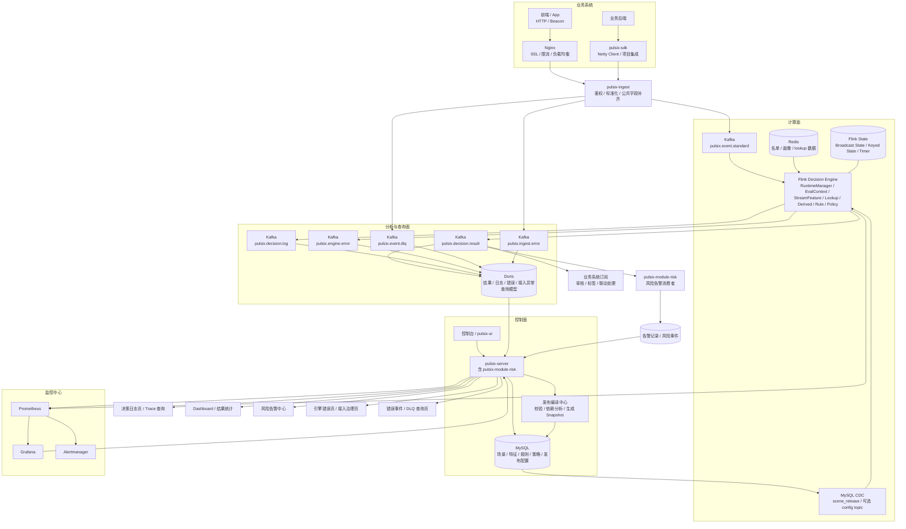

## 技术栈

- `Spring Boot`：作为控制平台后端与服务启动容器，承载场景、事件、特征、规则、策略、发布、仿真、日志等控制面能力，不只是基础 CRUD。
- `MyBatis-Plus`：作为控制面持久层框架，负责设计态与管理态数据访问，如场景、规则、策略、发布版本、仿真报告、审计日志等。
- `Netty`：主要用于 `pulsix-sdk -> pulsix-ingest` 的高性能长连接接入，支撑高并发事件上报；接入层负责鉴权、标准化、公共字段补齐和异常分流。
- `Flink`：作为核心实时决策引擎，消费标准事件与配置快照，基于 `Keyed State + Broadcast State` 完成流式特征计算、快照热更新、规则/策略执行和低延迟决策输出。
- `Kafka`：作为系统流转总线，承载标准事件流、配置快照流、决策结果流、决策日志流、引擎异常流和接入错误流，实现解耦、削峰和多下游订阅。
- `MySQL`：作为设计态与管理态主存储，保存场景、特征、规则、策略、名单、发布版本、仿真报告和审计数据；不承担热路径逐条查询与流式状态存储。
- `Redis`：作为在线查询与辅助上下文层，承载黑白名单、用户/设备/IP 画像、热点 lookup 数据及部分 materialized 特征缓存；主实时聚合状态仍以 Flink State 为主。
- `Doris`：作为分析查询读库，承载决策结果、命中明细、错误事件、DLQ/坏数据等大规模明细查询、分页筛选与趋势分析能力。
- `Aviator`：作为默认表达式引擎，承担大部分规则条件判断与派生特征计算，强调预编译、缓存、高频执行性能和可解释性。
- `Groovy`：作为高级脚本扩展能力，用于少量 `Aviator` 不够优雅的复杂规则/派生逻辑；应做发布前校验、预编译、沙箱、缓存和类加载隔离，不宜作为默认主力。
- `Prometheus + Grafana`：负责 Kafka Lag、Flink Checkpoint、Backpressure、Redis RT、决策延迟、规则命中率等指标的统一观测。
- `Docker Compose`：用于本地/演示环境的一键部署，快速拉起 `MySQL`、`Redis`、`Kafka`、`Flink` 等依赖，便于联调与 Demo 展示。

**一句话总述**
- `pulsix` 是一个基于 `Spring Boot`、`Flink`、`Kafka`、`Redis`、`MySQL`、`Doris` 构建的分层式实时风控平台，结合 `Netty` 接入、`Aviator/Groovy` 动态规则、运行时快照与 `Broadcast State` 热更新能力，支撑实时特征计算、规则决策、日志追溯与分析查询。

## 架构图

