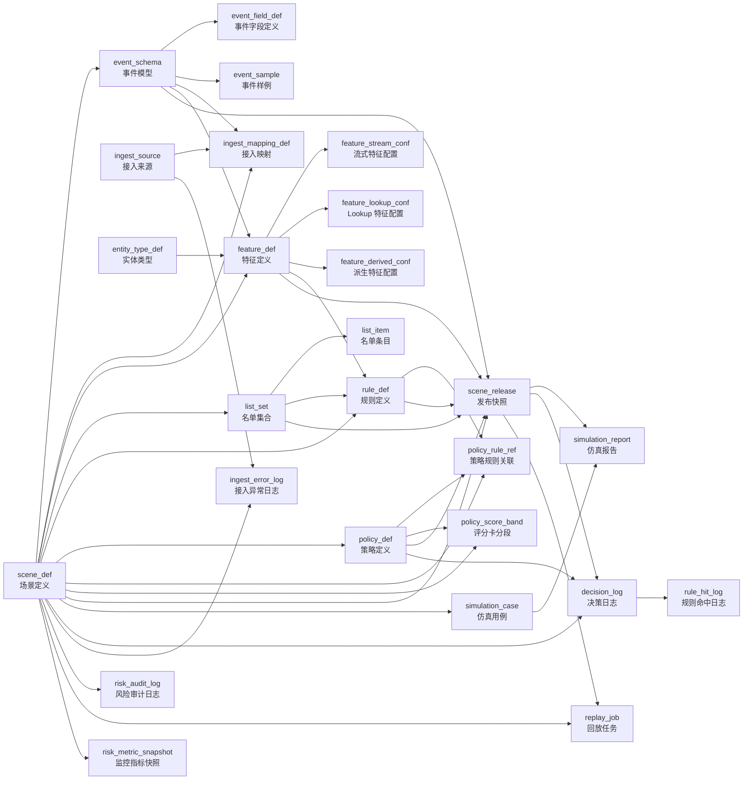
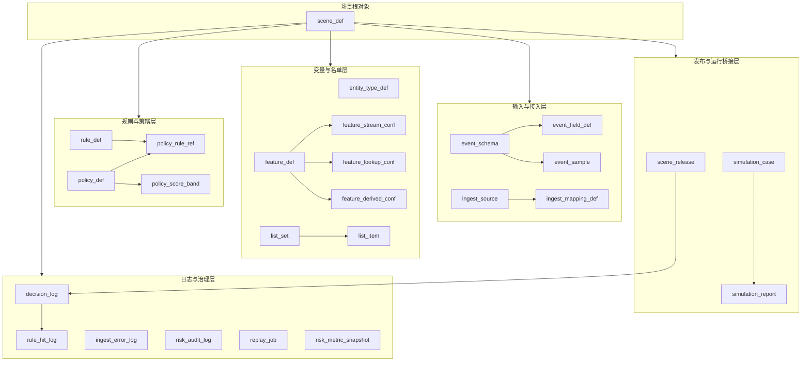

## 风控功能、模块与表映射

这份文档不只描述“场景 → 事件 → 特征 → 规则 → 策略 → 发布 → 日志”的主链路关系图，还把风控功能、前端页面模块、后端子域模块和数据库表放到同一张认知地图里，帮助你从发布编译视角整体理解 `docs/sql/pulsix-risk.sql`。

### 1. 主链路关系图

### 2. 分层理解图

### 3. 你可以按这条主线去读 SQL

1. `scene_def`：先确定一个场景下要解决什么风控问题。
2. `event_schema` + `event_field_def` + `event_sample`：定义这个场景接收什么标准事件。
3. `ingest_source` + `ingest_mapping_def`：定义外部系统怎么把原始报文清洗成标准事件。
4. `feature_def` + `feature_*_conf`：定义引擎可用的变量来源。
5. `list_set` + `list_item`：定义黑白名单等外部辅助判断依据。
6. `rule_def`：定义单条判断逻辑。
7. `policy_def` + `policy_rule_ref` + `policy_score_band`：定义多条规则如何收敛成最终决策。
8. `scene_release`：把设计态对象编译成运行时快照。
9. `simulation_*`、`decision_log`、`rule_hit_log`：验证发布结果并支持线上追溯。
10. `ingest_error_log`、`risk_audit_log`、`replay_job`、`risk_metric_snapshot`：负责治理、审计、回放和监控。

### 4. 关键记忆法

- `scene_def` 是根对象，所有设计态核心对象都应围绕 `scene_code` 组织。
- `event_*` 解决“输入长什么样”。
- `feature_*` 和 `list_*` 解决“规则执行时有哪些上下文变量”。
- `rule_def` 解决“单条怎么判断”。
- `policy_*` 解决“多条规则如何汇总为最终动作”。
- `scene_release` 解决“设计态如何编译成运行态快照”。
- `decision_log` / `rule_hit_log` 解决“线上结果如何追溯”。

### 5. 最重要的外键语义（逻辑外键）

虽然当前 SQL 主要用逻辑关联而没有显式物理外键，但你脑子里要把它们当成下面这些关系：

- `event_schema.scene_code -> scene_def.scene_code`
- `event_field_def.(scene_code, event_code) -> event_schema.(scene_code, event_code)`
- `ingest_mapping_def.(scene_code, event_code) -> event_schema.(scene_code, event_code)`
- `feature_def.scene_code -> scene_def.scene_code`
- `feature_*_conf.(scene_code, feature_code) -> feature_def.(scene_code, feature_code)`
- `list_set.scene_code -> scene_def.scene_code`
- `list_item.(scene_code, list_code) -> list_set.(scene_code, list_code)`
- `rule_def.scene_code -> scene_def.scene_code`
- `policy_def.scene_code -> scene_def.scene_code`
- `policy_rule_ref.(scene_code, policy_code) -> policy_def.(scene_code, policy_code)`
- `policy_rule_ref.(scene_code, rule_code) -> rule_def.(scene_code, rule_code)`
- `policy_score_band.(scene_code, policy_code) -> policy_def.(scene_code, policy_code)`
- `scene_release.scene_code -> scene_def.scene_code`
- `decision_log.(scene_code, version_no) -> scene_release.(scene_code, version_no)`
- `rule_hit_log.decision_id -> decision_log.id`

### 6. 读图时要特别注意的两个点

- `scene_release` 不是普通配置表，而是“发布编译产物表”；它是设计态和运行态之间的桥。
- `decision_log` / `rule_hit_log` 不直接驱动规则执行，它们是结果追溯与分析表，属于运行后数据。

### 7. 功能与表对应

这一部分按 `docs/wiki/风控功能清单.md` 的功能项来映射，帮助你从“我要做什么功能”反推“数据库要看哪些表”。

#### 7.1 场景与事件模型

**对应功能**

- 场景管理
- 事件 Schema 管理
- 字段定义
- 样例报文
- 基础校验

**对应表**

- `scene_def`
- `event_schema`
- `event_field_def`
- `event_sample`
- `entity_type_def`

**每张表的作用**

- `scene_def`
  - 风控平台的一级根对象。
  - 定义一个风控场景是什么、默认事件是什么、默认策略是什么。
  - 你后面看到的大多数对象，都会按 `scene_code` 归属到某个场景。

- `event_schema`
  - 定义场景下有哪些标准事件，比如 `login`、`trade`。
  - 它回答的是“这个场景会接收哪几类业务事件”。

- `event_field_def`
  - 定义标准事件里有哪些字段、字段类型、是否必填、默认值和校验规则。
  - 它回答的是“事件结构长什么样、字段是否合法”。

- `event_sample`
  - 存放原始样例、标准样例和仿真样例。
  - 它主要用于页面展示、联调、教学和仿真输入复用。

- `entity_type_def`
  - 定义风控里常见的聚合维度，比如 `USER`、`DEVICE`、`IP`。
  - 它主要帮助你统一特征中心和聚合口径。

---

#### 7.2 事件接入层 / 接入治理

**对应功能**

- HTTP / Beacon / SDK 统一接入
- 来源识别
- 鉴权配置
- 字段清洗和格式转换
- 标准化映射
- 错误事件 / DLQ 查询
- 来源启停与接入治理

**对应表**

- `ingest_source`
- `ingest_mapping_def`
- `ingest_error_log`
- `event_schema`
- `event_field_def`

**每张表的作用**

- `ingest_source`
  - 描述“谁在接入平台”。
  - 包括来源编码、接入方式、鉴权方式、允许的场景范围、标准 Topic、错误 Topic、限流等。
  - 这是接入治理的主表。

- `ingest_mapping_def`
  - 描述“原始报文字段如何变成标准事件字段”。
  - 包括字段路径、转换方式、默认值、清洗规则、执行顺序。
  - 这是接入标准化的核心表。

- `ingest_error_log`
  - 记录接入失败或标准化失败的异常事件。
  - 用于 DLQ 查询、错误追踪、重放和接入排障。

- `event_schema`
  - 作为接入目标模型，定义接入后要落成哪种标准事件。

- `event_field_def`
  - 作为字段标准和校验依据，告诉接入层哪些字段必须有、格式怎么校验。

---

#### 7.3 特征中心

**对应功能**

- Stream Feature
- Lookup Feature
- Derived Feature
- COUNT / SUM / MAX / LATEST / DISTINCT_COUNT

**对应表**

- `feature_def`
- `feature_stream_conf`
- `feature_lookup_conf`
- `feature_derived_conf`
- `entity_type_def`
- `list_set`
- `list_item`

**每张表的作用**

- `feature_def`
  - 特征中心主表。
  - 定义特征编码、名称、类型、值类型、所属场景、关联事件、关联实体类型。
  - 它解决的是“平台里有哪些变量”。

- `feature_stream_conf`
  - 定义流式特征如何计算。
  - 包括来源事件、聚合维度、聚合类型、取值表达式、过滤条件、窗口大小、TTL。
  - 它解决的是“状态型/窗口型变量怎么产出”。

- `feature_lookup_conf`
  - 定义查询型特征如何从 Redis / 字典 / 名单取值。
  - 包括 lookup 类型、key 表达式、来源引用、超时、本地缓存 TTL。
  - 它解决的是“外部上下文变量怎么拿”。

- `feature_derived_conf`
  - 定义派生特征如何通过表达式或 Groovy 二次推导。
  - 包括表达式内容、依赖项、脚本沙箱、超时控制。
  - 它解决的是“复杂组合变量怎么得到”。

- `entity_type_def`
  - 给特征提供统一聚合主体，例如按用户、设备或 IP 聚合。

- `list_set` / `list_item`
  - 在很多项目里，名单既可以独立作为名单中心能力，也可以作为 Lookup Feature 的来源。
  - 比如“设备是否命中黑名单”本质上就是从名单中心查一个布尔值。

---

#### 7.4 名单中心

**对应功能**

- 黑名单 / 白名单
- 导入导出
- 启停
- 同步 Redis

**对应表**

- `list_set`
- `list_item`
- `feature_lookup_conf`
- `risk_audit_log`

**每张表的作用**

- `list_set`
  - 名单集合主表。
  - 定义名单编码、名单类型、匹配维度、存储方式、同步模式、同步状态。
  - 它解决的是“有哪些名单、这些名单怎么管理”。

- `list_item`
  - 名单条目表。
  - 存放具体命中的值，比如设备号、用户号、IP、手机号。
  - 它解决的是“名单里到底有哪些具体数据”。

- `feature_lookup_conf`
  - 把名单能力接到规则执行链路里。
  - 比如配置 `device_in_blacklist` 时，会引用名单编码作为 `source_ref`。

- `risk_audit_log`
  - 记录名单变更、导入、删除、启停等操作，满足审计要求。

---

#### 7.5 规则中心

**对应功能**

- 表达式规则
- 优先级
- 动作类型
- 命中原因模板
- 启停状态

**对应表**

- `rule_def`
- `feature_def`
- `feature_*_conf`
- `list_set`

**每张表的作用**

- `rule_def`
  - 规则中心主表。
  - 定义规则编码、表达式、优先级、命中动作、风险分、命中原因模板、状态。
  - 它解决的是“单条规则怎么判断、命中后怎么处理”。

- `feature_def` + `feature_*_conf`
  - 规则表达式里引用的变量来源。
  - 规则并不直接生成变量，它只是消费事件字段、特征值、名单结果来做判断。

- `list_set`
  - 如果规则是显式名单命中型规则，那么名单本身就是规则的外部依赖之一。

---

#### 7.6 策略中心

**对应功能**

- FIRST_HIT
- SCORE_CARD
- 默认动作
- 规则编排
- 分值分段

**对应表**

- `policy_def`
- `policy_rule_ref`
- `policy_score_band`
- `rule_def`
- `scene_def`

**每张表的作用**

- `policy_def`
  - 策略中心主表。
  - 定义策略模式、默认动作、分值计算模式、状态和版本。
  - 它解决的是“多条规则最终怎么收敛成一个决策”。

- `policy_rule_ref`
  - 策略和规则的关联表。
  - 定义策略下有哪些规则、执行顺序、是否启用、是否命中即停、是否需要加权。
  - 它解决的是“这套策略到底由哪些规则组成”。

- `policy_score_band`
  - 评分卡专用分段表。
  - 把累计分值映射为最终动作，比如 `0-49 PASS`、`50-79 REVIEW`、`80+ REJECT`。
  - 它解决的是“SCORE_CARD 最后怎么出结果”。

- `rule_def`
  - 提供策略编排所依赖的原子判断单元。

- `scene_def`
  - 通过 `default_policy_code` 指定场景当前主策略。
  - 一期最重要的作用就是“场景默认跑哪套策略”。

---

#### 7.7 发布中心 / 运行时快照 / 热更新

**对应功能**

- 发布前校验
- 依赖分析
- 快照编译
- 版本号
- 发布记录
- 基础回滚
- 热更新

**对应表**

- `scene_release`
- `scene_def`
- `event_schema`
- `event_field_def`
- `feature_def`
- `feature_*_conf`
- `list_set`
- `rule_def`
- `policy_def`
- `policy_rule_ref`
- `policy_score_band`
- `risk_audit_log`

**每张表的作用**

- `scene_release`
  - 发布中心最核心的表。
  - 存运行时快照、checksum、发布状态、校验结果、依赖摘要、发布时间、生效时间、回滚来源版本。
  - 它不是设计态配置表，而是“编译产物表”。

- `scene_def`
  - 提供发布入口和默认策略选择依据。

- `event_schema` + `event_field_def`
  - 提供输入模型，发布时要检查字段是否完整、变量引用是否合法。

- `feature_def` + `feature_*_conf`
  - 提供变量定义和执行规格，发布时要做依赖分析、循环依赖检查、表达式校验。

- `list_set`
  - 提供名单依赖摘要，发布快照里通常要知道当前规则依赖了哪些名单。

- `rule_def`
  - 提供可执行规则集合，发布时要校验表达式、依赖变量、启用状态。

- `policy_def` + `policy_rule_ref` + `policy_score_band`
  - 提供策略执行计划和收敛逻辑，发布时要展开成运行态策略计划。

- `risk_audit_log`
  - 记录谁发布了什么版本、为什么发布、谁做了回滚。

---

#### 7.8 仿真测试 / 回放对比

**对应功能**

- 输入模拟事件
- 指定场景 / 版本
- 展示特征值
- 展示命中链路
- 回归验证
- 回放对比

**对应表**

- `simulation_case`
- `simulation_report`
- `scene_release`
- `decision_log`
- `rule_hit_log`
- `replay_job`

**每张表的作用**

- `simulation_case`
  - 固化仿真输入、期望动作、期望命中规则。
  - 它解决的是“怎么把一个测试场景固定下来反复执行”。

- `simulation_report`
  - 存某次仿真执行的结果。
  - 结果里通常包含最终动作、命中规则、特征快照、耗时。

- `scene_release`
  - 仿真运行时通常需要指定版本，因此它提供仿真所依赖的运行快照。

- `decision_log` + `rule_hit_log`
  - 可复用为仿真后的结果展示或执行明细查看依据。

- `replay_job`
  - 用历史样本对比基线版本和目标版本的差异。
  - 它解决的是“改了规则后，结果到底变了多少”。

---

#### 7.9 决策日志与追溯

**对应功能**

- 按 `traceId` / `eventId` 查结果
- 查看命中规则
- 查看特征快照
- 查看版本号
- 查看耗时

**对应表**

- `decision_log`
- `rule_hit_log`
- `scene_release`
- `policy_def`

**每张表的作用**

- `decision_log`
  - 决策结果主表。
  - 存最终动作、最终分值、策略编码、版本号、特征快照、规则摘要、耗时、输入事件等。
  - 它解决的是“某条事件最终被怎么处理了”。

- `rule_hit_log`
  - 决策结果明细表。
  - 存每条规则是否命中、命中顺序、命中原因、贡献分值、关键命中值。
  - 它解决的是“为什么会出这个结果”。

- `scene_release`
  - 决策日志里的 `version_no` 最终要回到某个发布快照，才能知道当时跑的是哪一版配置。

- `policy_def`
  - 用于解释当时采用的是哪种策略模式，例如 `FIRST_HIT` 还是 `SCORE_CARD`。

---

#### 7.10 Dashboard / 基础监控

**对应功能**

- 事件量
- 决策量
- PASS / REVIEW / REJECT 占比
- 命中 Top 规则
- P95 延迟
- Kafka Lag / Checkpoint 成功率等时序指标

**对应表**

- `risk_metric_snapshot`
- `decision_log`
- `rule_hit_log`
- `ingest_error_log`

**每张表的作用**

- `risk_metric_snapshot`
  - 指标快照主表。
  - 用于按分钟 / 小时沉淀监控指标，支撑 Dashboard 页面。

- `decision_log`
  - 可以统计总决策量、动作分布、延迟分布。

- `rule_hit_log`
  - 可以统计命中 Top 规则、规则命中率、规则贡献分。

- `ingest_error_log`
  - 可以统计接入异常量、DLQ 数量、错误类型分布。

---

#### 7.11 审计日志

**对应功能**

- 谁改了规则
- 谁发布了版本
- 改了什么字段
- 谁导入了名单

**对应表**

- `risk_audit_log`
- `scene_release`
- `rule_def`
- `list_set`
- `list_item`

**每张表的作用**

- `risk_audit_log`
  - 风控领域专用审计表。
  - 记录操作人、业务对象、动作类型、变更前 JSON、变更后 JSON、备注、操作时间。
  - 它解决的是“配置变更是否可追责、可回看”。

- `scene_release`
  - 发布动作本身也属于重要审计对象。

- `rule_def` / `list_set` / `list_item`
  - 这些是最常见的审计目标对象。

---

#### 7.12 最小可运行交付 / Demo 链路

**对应功能**

- 默认账号、默认场景、默认规则、默认仿真样例、演示链路

**对应表**

- `scene_def`
- `event_schema`
- `event_field_def`
- `event_sample`
- `feature_def`
- `feature_*_conf`
- `rule_def`
- `policy_def`
- `policy_rule_ref`
- `policy_score_band`
- `scene_release`
- `simulation_case`
- `simulation_report`

**理解方式**

- 这些表一起构成“可演示、可发布、可仿真、可追溯”的最小闭环。
- 你只看单张表是看不出平台感的，必须把这些表连成链路理解。

---

#### 7.13 一张总表：功能与表映射速查

| 功能 | 核心表 | 说明 |
|---|---|---|
| 场景管理 | `scene_def` | 所有设计态对象的根 |
| 事件模型 | `event_schema`, `event_field_def`, `event_sample` | 定义标准输入 |
| 接入治理 | `ingest_source`, `ingest_mapping_def`, `ingest_error_log` | 定义来源、标准化、异常治理 |
| 特征中心 | `feature_def`, `feature_stream_conf`, `feature_lookup_conf`, `feature_derived_conf` | 定义引擎变量 |
| 名单中心 | `list_set`, `list_item` | 定义黑白名单和同步状态 |
| 规则中心 | `rule_def` | 定义单条判断逻辑 |
| 策略中心 | `policy_def`, `policy_rule_ref`, `policy_score_band` | 定义规则收敛方式 |
| 发布中心 | `scene_release` | 存运行态快照和版本信息 |
| 仿真测试 | `simulation_case`, `simulation_report` | 固化测试输入和结果 |
| 决策追溯 | `decision_log`, `rule_hit_log` | 查结果、查命中链路 |
| 回放对比 | `replay_job` | 比较不同版本结果差异 |
| 审计治理 | `risk_audit_log` | 记录配置变更和发布行为 |
| 监控看板 | `risk_metric_snapshot` | 沉淀监控时序指标 |

### 8. 功能 → 页面模块 → 后端模块 → 表

这一部分把“用户在平台上看到的功能”、“前端页面怎么组织”、“后端模块怎么承接”、“最终落到哪些表”串起来。

说明：

- 页面模块命名优先采用第 22 章建议的 `pulsix-ui/views/*` 页面域结构。
- 后端模块优先采用 `pulsix-module-risk` 内部的子域结构。
- 其中 `ingest/`、`audit-log/`、`replay/compare` 这类页面名，部分是我基于功能清单和模块边界做的推荐扩展；参考资料没有全部逐一写死，我会在对应条目里说明。

#### 8.1 总体映射速查表

| 功能域 | 页面模块 | 后端模块 | 典型应用服务 / 协作者 | 核心表 |
|---|---|---|---|---|
| 场景管理 | `views/scene/` | `pulsix-module-risk/service/scene` | `SceneApplicationService`（推荐命名） | `scene_def` |
| 事件模型 | `views/event/` | `pulsix-module-risk/service/event` | `EventSchemaApplicationService`（推荐命名） | `event_schema`, `event_field_def`, `event_sample` |
| 接入治理 | `views/event/` + `views/ingest/`（推荐扩展） | `pulsix-module-risk/service/event` + `pulsix-access/pulsix-ingest` | `IngestSourceApplicationService`（推荐命名） | `ingest_source`, `ingest_mapping_def`, `ingest_error_log` |
| 特征中心 | `views/feature/` | `pulsix-module-risk/service/feature` | `FeatureApplicationService` | `feature_def`, `feature_stream_conf`, `feature_lookup_conf`, `feature_derived_conf` |
| 名单中心 | `views/list/` | `pulsix-module-risk/service/list` | `ListApplicationService`（推荐命名） | `list_set`, `list_item` |
| 规则中心 | `views/rule/` | `pulsix-module-risk/service/rule` | `RuleApplicationService` | `rule_def` |
| 策略中心 | `views/policy/` | `pulsix-module-risk/service/policy` | `PolicyApplicationService` | `policy_def`, `policy_rule_ref`, `policy_score_band` |
| 发布中心 | `views/release/` | `pulsix-module-risk/service/release` | `ReleaseApplicationService`, `SceneConfigLoader`, `SceneConfigValidator`, `DependencyAnalyzer`, `SceneSnapshotCompiler`, `ReleasePublisher` | `scene_release` + 发布读取的全部设计态表 |
| 仿真测试 | `views/simulation/` | `pulsix-module-risk/service/simulation` | `SimulationApplicationService` | `simulation_case`, `simulation_report`, `scene_release` |
| 决策日志 | `views/decision-log/` | `pulsix-module-risk/service/log` | `DecisionLogQueryService`（推荐命名） | `decision_log`, `rule_hit_log`, `scene_release` |
| Dashboard / 监控 | `views/dashboard/` | `pulsix-module-risk/service/log` + `pulsix-module-infra`（推荐协作） | `DashboardQueryService`（推荐命名） | `risk_metric_snapshot`, `decision_log`, `rule_hit_log`, `ingest_error_log` |
| 审计日志 | `views/audit-log/`（推荐扩展） | `pulsix-module-system` + `pulsix-module-risk/service/log` | `AuditLogQueryService`（推荐命名） | `risk_audit_log` |
| 回放对比 | `views/release/compare/` 或 `views/simulation/replay/`（推荐扩展） | `pulsix-module-risk/service/release` 或 `service/simulation` | `ReplayApplicationService`（推荐命名） | `replay_job`, `scene_release`, `decision_log` |

#### 8.2 场景管理

**页面模块**

- `pulsix-ui/src/views/scene/`

**后端模块**

- `pulsix-module-risk/service/scene`
- `pulsix-module-risk/controller/scene`
- 这是第 20、22 章都明确建议保留的风险域子域。

**对应表**

- `scene_def`

**模块职责怎么理解**

- 页面模块负责场景列表、场景详情、场景启停、默认事件/默认策略配置。
- 后端 `scene` 子域负责场景 CRUD、场景校验、给发布模块提供场景元数据。
- `scene_def` 是整个风控控制面的根对象表。

---

#### 8.3 事件模型

**页面模块**

- `pulsix-ui/src/views/event/`

**后端模块**

- `pulsix-module-risk/service/event`
- `pulsix-module-risk/controller/event`

**对应表**

- `event_schema`
- `event_field_def`
- `event_sample`
- `entity_type_def`（辅助统一聚合维度）

**模块职责怎么理解**

- 页面模块负责事件定义、字段定义、样例报文、字段校验规则配置。
- 后端 `event` 子域负责事件模型保存、字段结构校验、样例预览、标准事件结构输出。
- `event_schema` 定义事件种类，`event_field_def` 定义字段结构，`event_sample` 定义调试样例。

---

#### 8.4 接入治理

**页面模块**

- 当前前端建议结构里没有单独列出 `ingest/` 页面域。
- 比较合理的做法是：
  - 接入映射配置先放在 `pulsix-ui/src/views/event/` 下；
  - 如果接入治理做强一点，再扩展 `pulsix-ui/src/views/ingest/`。
- 这里的 `views/ingest/` 是我基于功能清单做的推荐扩展命名。

**后端模块**

- 控制面配置侧：`pulsix-module-risk/service/event`
- 运行时接入执行侧：`pulsix-access/pulsix-ingest`
- 如果后续 SDK 接入治理增强，还会关联 `pulsix-access/pulsix-sdk`

**对应表**

- `ingest_source`
- `ingest_mapping_def`
- `ingest_error_log`
- `event_schema`
- `event_field_def`

**模块职责怎么理解**

- 页面模块负责接入源、鉴权、字段映射、错误事件查询。
- `pulsix-module-risk` 负责“接入配置如何管理”。
- `pulsix-access/pulsix-ingest` 负责“真正接入事件、鉴权、标准化、写 Kafka”。
- `ingest_source` 定义来源系统；`ingest_mapping_def` 定义标准化规则；`ingest_error_log` 定义异常事件留痕。

---

#### 8.5 特征中心

**页面模块**

- `pulsix-ui/src/views/feature/`

**后端模块**

- `pulsix-module-risk/service/feature`
- `pulsix-module-risk/controller/feature`
- 明确对应 `FeatureApplicationService`

**对应表**

- `feature_def`
- `feature_stream_conf`
- `feature_lookup_conf`
- `feature_derived_conf`
- `entity_type_def`
- `list_set` / `list_item`（名单型 lookup 的间接依赖）

**模块职责怎么理解**

- 页面模块负责三类特征的建模和参数配置。
- 后端 `feature` 子域负责按特征类型分发保存逻辑、依赖预检查、表达式预校验。
- `feature_def` 是统一主表；三张 `feature_*_conf` 分别承载三种执行规格。

---

#### 8.6 名单中心

**页面模块**

- `pulsix-ui/src/views/list/`

**后端模块**

- `pulsix-module-risk/service/list`
- `pulsix-module-risk/controller/list`

**对应表**

- `list_set`
- `list_item`
- `risk_audit_log`

**模块职责怎么理解**

- 页面模块负责名单集合、名单条目、导入导出、启停和同步状态查看。
- 后端 `list` 子域负责名单保存、导入批次处理、同步 Redis。
- `list_set` 是名单头，`list_item` 是名单体，`risk_audit_log` 负责变更审计。

---

#### 8.7 规则中心

**页面模块**

- `pulsix-ui/src/views/rule/`

**后端模块**

- `pulsix-module-risk/service/rule`
- `pulsix-module-risk/controller/rule`
- 明确对应 `RuleApplicationService`

**对应表**

- `rule_def`
- `feature_def`
- `feature_*_conf`
- `list_set`

**模块职责怎么理解**

- 页面模块负责规则编辑器、表达式校验、优先级、动作类型、命中原因模板。
- 后端 `rule` 子域负责规则保存、启停、语法校验、依赖提示。
- `rule_def` 是规则主表，特征和名单表是规则的上游依赖。

---

#### 8.8 策略中心

**页面模块**

- `pulsix-ui/src/views/policy/`

**后端模块**

- `pulsix-module-risk/service/policy`
- `pulsix-module-risk/controller/policy`
- 明确对应 `PolicyApplicationService`

**对应表**

- `policy_def`
- `policy_rule_ref`
- `policy_score_band`
- `rule_def`
- `scene_def`

**模块职责怎么理解**

- 页面模块负责策略定义、规则编排、FIRST_HIT / SCORE_CARD 配置、评分段配置。
- 后端 `policy` 子域负责策略合法性检查、规则顺序绑定、评分带保存。
- `policy_def` 管总策略；`policy_rule_ref` 管规则编排；`policy_score_band` 管评分卡分段。

---

#### 8.9 发布中心

**页面模块**

- `pulsix-ui/src/views/release/`

**后端模块**

- `pulsix-module-risk/service/release`
- `pulsix-module-risk/controller/release`
- 明确对应 `ReleaseApplicationService`
- 协作者包括：
  - `SceneConfigLoader`
  - `SceneConfigValidator`
  - `DependencyAnalyzer`
  - `SceneSnapshotCompiler`
  - `ReleasePublisher`

**对应表**

- `scene_release`
- `scene_def`
- `event_schema`
- `event_field_def`
- `feature_def`
- `feature_stream_conf`
- `feature_lookup_conf`
- `feature_derived_conf`
- `list_set`
- `rule_def`
- `policy_def`
- `policy_rule_ref`
- `policy_score_band`
- `risk_audit_log`

**模块职责怎么理解**

- 页面模块负责发布前检查、发布、版本查看、回滚、查看校验报告和依赖摘要。
- 后端 `release` 子域不是 CRUD 子域，而是编译子域；它会读取多个设计态表，最终写入 `scene_release`。
- `scene_release` 是发布产物表，不是普通配置表。

---

#### 8.10 仿真测试

**页面模块**

- `pulsix-ui/src/views/simulation/`

**后端模块**

- `pulsix-module-risk/service/simulation`
- `pulsix-module-risk/controller/simulation`
- 明确对应 `SimulationApplicationService`

**对应表**

- `simulation_case`
- `simulation_report`
- `scene_release`
- `decision_log`
- `rule_hit_log`

**模块职责怎么理解**

- 页面模块负责输入测试事件、指定场景/版本、查看特征快照和命中链路。
- 后端 `simulation` 子域负责构建仿真上下文、调用统一执行内核、保存仿真报告。
- `simulation_case` 定义固定样例；`simulation_report` 记录执行结果；必要时也可联动决策日志明细。

---

#### 8.11 决策日志与分析查询

**页面模块**

- `pulsix-ui/src/views/decision-log/`
- `pulsix-ui/src/views/dashboard/`

**后端模块**

- `pulsix-module-risk/service/log`
- `pulsix-module-risk/controller/log`
- 这里通常是查询型服务，不强调复杂写流程

**对应表**

- `decision_log`
- `rule_hit_log`
- `scene_release`
- `risk_metric_snapshot`
- `ingest_error_log`

**模块职责怎么理解**

- `decision-log` 页面负责按 `traceId` / `eventId` 查结果、查看命中链路。
- `dashboard` 页面负责动作占比、命中 Top 规则、延迟分布、异常量等指标展示。
- 后端 `log` 子域主要做聚合查询和详情查询。

---

#### 8.12 审计日志

**页面模块**

- 第 22 章给的页面示例里没有单独列出 `audit-log/`。
- 如果你把审计作为独立页面能力，推荐补一个：`pulsix-ui/src/views/audit-log/`。
- 这是我基于功能清单和系统模块边界给出的推荐扩展。

**后端模块**

- 通用权限与平台审计：`pulsix-module-system`
- 风控对象细粒度审计查询：`pulsix-module-risk/service/log`
- 产生审计事件的业务子域：`rule`、`list`、`release` 等

**对应表**

- `risk_audit_log`
- 也可复用系统审计表（如果项目最终统一接入）

**模块职责怎么理解**

- 页面模块负责按操作人、业务对象、时间范围、动作类型查看变更记录。
- `pulsix-module-system` 负责平台级审计框架，`pulsix-module-risk` 负责风控领域细粒度 before/after 内容。

---

#### 8.13 回放对比

**页面模块**

- 第 22 章没有单独给出回放页面名。
- 更推荐的两个入口是：
  - `pulsix-ui/src/views/release/compare/`
  - `pulsix-ui/src/views/simulation/replay/`
- 这是我根据“发布对比”和“仿真回放”两种使用场景给出的推荐扩展。

**后端模块**

- 如果重点是版本差异分析：放 `pulsix-module-risk/service/release`
- 如果重点是样本回放执行：放 `pulsix-module-risk/service/simulation`
- 两种都合理，取决于你想把“回放”更靠近发布还是更靠近测试

**对应表**

- `replay_job`
- `scene_release`
- `decision_log`
- `rule_hit_log`

**模块职责怎么理解**

- 页面模块负责选择基线版本、目标版本、输入样本来源，并查看差异摘要。
- 后端负责调度回放任务、执行差异对比、输出样本差异和汇总结果。
- `replay_job` 是回放任务表，不是实时执行表。

---

#### 8.14 一个最推荐的认知方式

你后面再看整套风控平台时，可以按下面这四层去定位问题：

1. **功能层**：我要实现什么能力？比如发布、仿真、日志追溯。
2. **页面层**：用户会在哪个页面操作？比如 `release/`、`simulation/`、`decision-log/`。
3. **后端层**：这个能力该落在哪个子域？比如 `service/release`、`service/simulation`、`service/log`。
4. **数据层**：这个子域最终会读写哪些表？比如 `scene_release`、`simulation_case`、`decision_log`。

只要你把这四层连起来，后面无论是继续改 SQL、设计接口，还是拆前后端任务，都会非常清楚。
