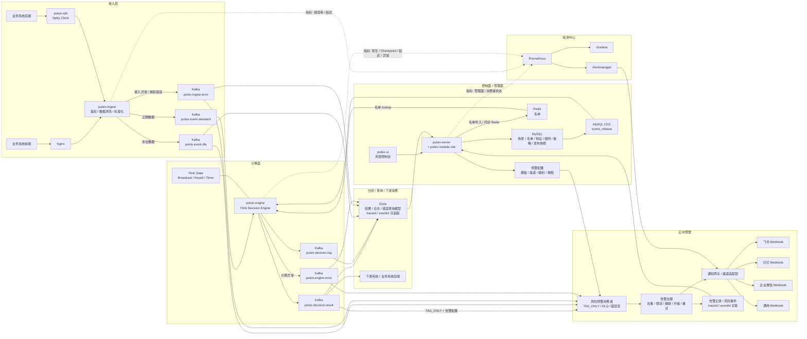

# 项目一期定位

- 不做在线同步决策api, 仅提供异步风控链路, 风控动作仅支持 PASS, TAG_ONLY, REVIEW, REJECT 四种, 业务系统或下游系统需要具备异步处理风控结果的能力.
- redis只做名单,不做画像和热点特征. 页面提供名单管理, 支持手动同步数据到redis.
- 只做 FIRST_HIT, 忽略其他

# 架构图



# 项目模块

```
pulsix/
├── pulsix-dependencies/              # BOM / 版本对齐
├── pulsix-access/
│   ├── pulsix-ingest/               # 接入层服务端统一接入器 (Netty Server)
│   └── pulsix-sdk/                  # 业务后端高性能接入 SDK (Netty Client)
├── pulsix-framework/
│   ├── pulsix-common/               # 公共工具、常量、共享 DTO/CommonApi
│   ├── pulsix-kernel/               # 执行内核（仿真 + Flink 共用）
│   └── pulsix-spring-boot-starter-* # 各类基础组件
├── pulsix-server/                   # Spring Boot 启动器
├── pulsix-module-system/            # 用户、权限、租户、菜单、审计
├── pulsix-module-infra/             # 配置、文件、任务、监控、基础日志
├── pulsix-module-risk/              # 风控控制面核心业务+实时预警(飞书,钉钉,webhook等)
├── pulsix-engine/                   # Flink 决策引擎
├── pulsix-ui/                       # Vue3 控制台
├── deploy/                          # docker-compose / shell 脚本
├── docs/                            # 架构图、时序图、设计文档
└── README.md
```

# 控制平台

## 页面列表

说明：用户、角色、菜单、审计等基础页面继续由 `pulsix-module-system` 承担，`pulsix-module-risk` 重点承接风控控制面、查询面和告警面。

| 一级菜单 | 二级菜单 | 作用 |
| --- | --- | --- |
| 风控总览 | Dashboard | 查看事件量、决策量、命中规则、活跃版本、延迟和异常。 |
| 配置中心 | 场景管理 | 管理登录风控、注册反作弊、交易风控等场景，是其他配置对象的组织根。 |
| 配置中心 | 事件模型 | 管理事件类型、字段定义、样例报文、默认值、必填校验、标准事件预览。 |
| 配置中心 | 实体类型 | 定义 `user/device/ip/mobile` 等实体及主键字段，统一特征聚合口径。 |
| 配置中心 | 名单中心 | 管理黑白名单、标签名单，支持导入导出、启停和同步 Redis。 |
| 配置中心 | 特征中心 | 管理 `Stream / Lookup / Derived Feature` 三类特征。 |
| 配置中心 | 规则中心 | 管理规则表达式、命中动作、优先级、命中原因模板。 |
| 配置中心 | 策略中心 | 把多条规则编排为 `FIRST_HIT` 策略，并配置默认动作和顺序。 |
| 发布中心 | 发布管理 | 做发布前校验、依赖分析、快照编译和正式发布。 |
| 发布中心 | 发布记录 | 查看 `scene_release` 历史版本、状态和发布信息。 |
| 发布中心 | 版本对比 / 回滚 | 查看版本差异，快速回滚到上一个稳定版本。 |
| 仿真测试 | 单条事件仿真 | 输入事件 JSON，指定场景和版本，查看特征值、命中规则和最终动作。 |
| 仿真测试 | 仿真用例 | 保存测试样例，作为回归验证和发布前校验的输入资产。 |
| 仿真测试 | 仿真报告 | 查看每次仿真的执行结果、命中规则和是否通过预期。 |
| 查询分析 | 决策日志 | 按 `traceId / eventId / sceneCode` 查询一次决策。 |
| 查询分析 | 命中明细 | 查看某次决策命中了哪些规则、命中值和原因。 |
| 查询分析 | 风险事件查询 | 查询高风险事件、`TAG_ONLY` 结果和可疑事件沉淀记录。 |
| 告警中心 | 告警配置 | 管理模板、渠道、级别、静默、去重、限流等规则。 |
| 告警中心 | 告警记录 | 查看飞书、钉钉、企业微信、Webhook 等告警发送记录。 |
| 接入治理 | 接入源管理 | 管理接入来源、来源启停状态和基础接入信息。 |
| 接入治理 | 鉴权配置 | 管理 SDK/HTTP 接入鉴权参数和认证方式。 |
| 接入治理 | 错误治理 | 统一查询解析失败、标准化失败和 `DLQ` 事件，可按错误类型分标签查看。 |
| 接入治理 | 接入指引 | 展示字段说明、样例报文和 SDK 接入说明，方便业务方接入。 |

## 页面开发

建议不要按页面一个个平铺推进，而是按主链路推进：`定义 -> 编译 -> 验证 -> 查询 -> 运营`。

1. 先搭 `risk` 菜单、路由、页面骨架和通用 CRUD 能力，`Dashboard` 先保留基础占位。
2. 优先做场景管理和事件模型；如果要统一实体聚合口径，可同步补上实体类型。
3. 再做名单中心和特征中心，先支撑最小可用的 lookup 和实时特征能力。
4. 然后做规则中心和策略中心，先把 `FIRST_HIT` 主链路跑通。
5. 接着做发布管理和发布记录，让设计态配置能编译成 `scene_release` 快照。
6. 发布链路稳定后补版本对比 / 回滚，先把版本治理闭环补齐。
7. 然后做单条事件仿真、仿真用例、仿真报告，用来验证线上线下执行一致性。
8. 再做决策日志、命中明细和风险事件查询，让平台具备追溯和结果查询能力。
9. 接着补接入源管理、鉴权配置、错误治理；接入链路稳定后再补接入指引（可选）。
10. 最后做告警配置、告警记录，并完善 `Dashboard` 指标展示等平台化增强能力。

# 中间件版本

| 中间件           |         推荐版本 | 
|---------------|-------------:|
| MySQL         |    8.4.8 LTS | 
| Redis         |        7.4.7 | 
| Kafka         | 3.9.1（KRaft） | 
| Doris         |        3.1.4 | 
| Elasticsearch |       8.18.8 | 
| Prometheus    |    3.5.1 LTS | 
| Grafana       |       12.4.0 | 
| Kafka UI      |        1.4.2 | 
