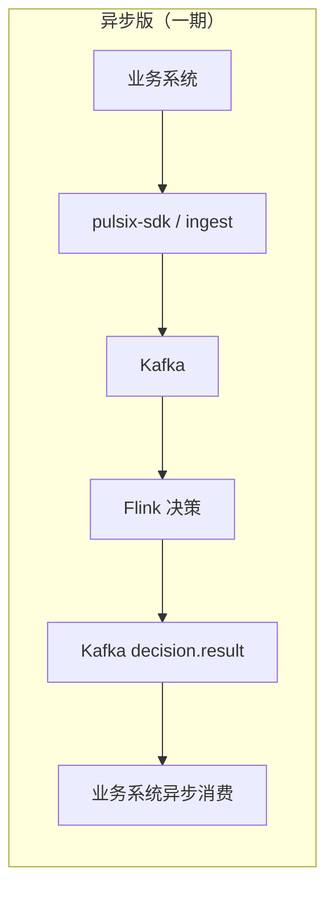
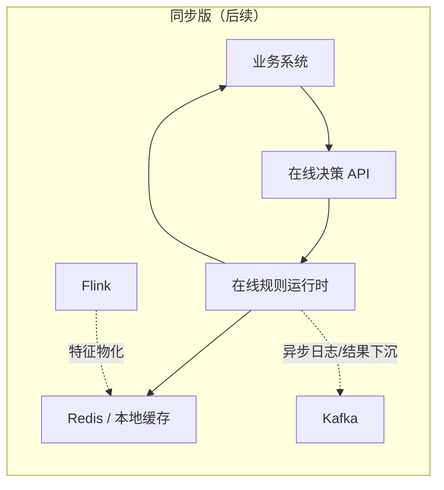

# 第一章

**本章一句话定义**
- 实时风控系统，是在业务事件发生当下，结合`当前事件 + 实时状态 + 历史画像/名单 + 规则策略`，在`毫秒到秒级`内产出风险动作的在线决策系统。

**第1章只保留的关键信息**
- 它解决的是`事中决策是否放行`，不是`事后分析谁有问题`。
- 它本质上是`风险决策系统`，输出的不是简单布尔值，而是`PASS / REVIEW / REJECT / TAG`等动作。
- 它不是普通规则引擎；规则判断只是最后一层，前面还包括`事件接入、上下文构建、实时特征、画像/名单查询、策略收敛、结果输出、日志追踪`。
- 它在业务中的位置是`关键决策点`，可以理解成业务系统的`在线风险大脑 / 在线决策中枢`。
- 它天然是`事件驱动 + 状态驱动`系统：输入核心是业务事件流，决策依赖行为上下文和历史状态，而不是只看当前一条记录。
- 第1章的重点是先建立正确认知；特征、规则、策略、快照、发布、Flink 执行链路等细节由后续章节展开，这里不重复。

**一期落地结论（完整保留）**

**一期定位**
- 不做`同步在线决策`。
- 只做：`事件接入 -> Flink 决策 -> 决策结果流输出 -> 下游异步消费`。
- 一期定位是：**异步实时风控决策平台**，不是同步裁决网关。

**适用边界**
- 适合：业务允许`挂起 / 延迟处理 / 补偿 / 撤销`的场景。
- 不适合：登录、即时支付、即时放款这类`必须当场给结果`的强同步场景。

**一期只保留 4 个动作**
- `PASS`：明确放行。
- `TAG_ONLY`：不阻断，只打标/告警/联动。
- `REVIEW`：进入人工审核或待处理队列。
- `REJECT`：异步拒绝，终止后续流程。

**动作使用原则**
- `PASS`：用于闭环、统计、追踪；不能用“没结果”代替。
- `TAG_ONLY`：最适合一期；常用于风险标签、飞书/钉钉告警、后续联动。
- `REVIEW`：仅用于业务支持挂起的场景。
- `REJECT`：仅用于业务还来得及撤销/关闭的场景。

**业务系统接入前提**
- 必须能`异步消费`风控结果。
- 必须有业务`中间状态`，如`WAIT_RISK / PENDING_REVIEW / REJECTED`。
- 必须支持`幂等`、`超时兜底`、`补偿/撤销`。
- 不能假设“没收到风控结果 = PASS”。

**3 条原则**
- `一事件一结果`：进入风控主链并成功处理的事件，原则上都应产出一条`DecisionResult`；即使没有规则命中，也通常会有一个明确的`PASS`。
- `风控产结果 ≠ 业务必等待`：风控系统可以对每条事件产出结果，但业务系统不一定要用每条结果控制主流程；一期只支持`观察型`和`异步控制型`场景，不支持`强同步控制型`场景。
- `没结果不等于 PASS`：未收到风控结果，可能是事件未入链路、Kafka 积压、Flink 异常、Sink 失败或消费者异常；如果业务流程依赖风控结果推进，就必须有`WAIT_RISK`、超时处理和补偿机制。

**典型场景映射**
- `PASS`：普通提现申请通过，进入后续处理。
- `TAG_ONLY`：异常登录打标签，并发飞书/钉钉告警。
- `REVIEW`：高风险订单进入人工审核，暂不发货。
- `REJECT`：提现申请异步判拒，业务关闭申请。

**异步版 vs 同步版**

**同步改造的关键理解**
- 真正的同步在线决策，核心不是“结果写 Kafka 还是写 Redis”，而是：**业务线程是否能在一次调用中直接拿到风控结果**。
- `业务 -> Kafka -> Flink -> Redis -> 业务查 Redis`这种模式，本质上仍然是**异步产出结果 + 业务轮询查询**，不属于真正的同步在线决策。
- Redis 在同步架构中更适合作为：`名单/画像/在线特征/热点状态`的查询源，而不是业务线程等待风控结果的主通道。
- 如果后续要做同步能力，更合理的方向是：**保留现有异步链，再新增一套在线决策服务**，让业务系统同步调用该服务直接获取`PASS / REVIEW / REJECT`，而日志、审计、分析结果再异步写 Kafka。

**一句话总括**
- 一期`pulsix`只解决“**异步产出标准风控结论，并让下游消费**”这件事，不解决“**业务线程同步等待风控返回**”的问题；若后续扩展同步能力，应新增`在线决策服务`，而不是让业务侧去轮询 Redis 等待 Flink 结果。
