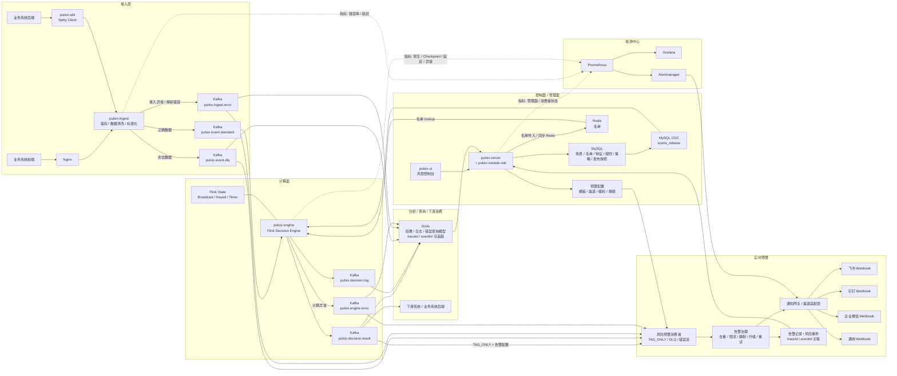

# 项目一期定位

- 不做在线同步决策api, 仅提供异步风控链路, 风控动作仅支持 PASS, TAG_ONLY, REVIEW, REJECT 四种, 业务系统或下游系统需要具备异步处理风控结果的能力.
- redis只做名单,不做画像和热点特征. 页面提供名单管理, 支持手动同步数据到redis.
- 只做 FIRST_HIT, 忽略其他

# 架构图



# 项目模块

```
pulsix/
├── pulsix-dependencies/              # BOM / 版本对齐
├── pulsix-access/
│   ├── pulsix-ingest/               # 接入层服务端统一接入器 (Netty Server)
│   └── pulsix-sdk/                  # 业务后端高性能接入 SDK (Netty Client)
├── pulsix-framework/
│   ├── pulsix-common/               # 公共工具、常量、共享 DTO/CommonApi
│   ├── pulsix-kernel/               # 执行内核（仿真 + Flink 共用）
│   └── pulsix-spring-boot-starter-* # 各类基础组件
├── pulsix-server/                   # Spring Boot 启动器
├── pulsix-module-system/            # 用户、权限、租户、菜单、审计
├── pulsix-module-infra/             # 配置、文件、任务、监控、基础日志
├── pulsix-module-risk/              # 风控控制面核心业务+实时预警(飞书,钉钉,webhook等)
├── pulsix-engine/                   # Flink 决策引擎
├── pulsix-ui/                       # Vue3 控制台
├── deploy/                          # docker-compose / shell 脚本
├── docs/                            # 架构图、时序图、设计文档
└── README.md
```

